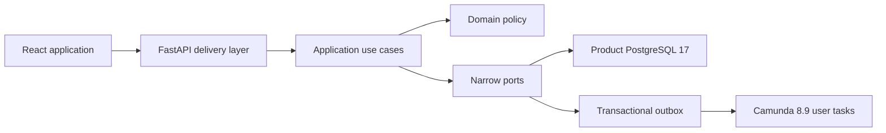

# ISTARI Service Master Implementation Plan

## Route lifecycle tracking and analytical presentation, 10 August 2026

- [x] Make request title the primary tracking identity while retaining linked
  references, ownership, required date and submission date.
- [x] Show the selected organisation route and delivery lifecycle for every
  request visible to an exact JIOC, command or Ops route member.
- [x] Add a direct, read-only historical detail route whose backend query repeats
  route membership and whose schema excludes actions, clarification, feedback
  and product content.
- [x] Add current-status, due-risk and active-age donut charts and a median-to-
  90th-percentile stage-duration graphic without creating a new analytics or
  authorisation path.
- [x] Retain labelled legends, content-free summaries, accessible table parity,
  keyboard focus and reduced-motion behaviour.
- [x] Pass backend and frontend coverage gates, repository quality gates,
  production build, live JIOC link navigation and browser console review.

## GitHub quality and dependency automation, 9 August 2026

- [x] Replace the Windows-only secure-production test path with a portable
  absolute temporary path so the Linux backend gate exercises the intended rules.
- [x] Align the repository with Dependabot's native `uv` ecosystem and supported
  pnpm 10 lockfile processing.
- [x] Add Dependabot coverage for security-tool Dockerfiles and root Compose
  references.
- [x] Run Actionlint, the OpenAPI consumer contract, current-source Gitleaks and
  gated reachable-history scanning in GitHub Actions.
- [x] Stage Gitleaks input from the exact tracked-file inventory so force-added
  files cannot be hidden by Docker ignore rules.
- [x] Add weekly execution, explicit job deadlines and retained coverage and
  secret-scan evidence.
- [x] Put Actionlint under Docker dependency automation and protect the split
  container workflow with a semantic image, migration, SBOM and teardown contract.
- [x] Exclude locally built Compose output tags from registry lookups while
  retaining update coverage for the external Compose bootstrap image.
- [x] Extend source line enforcement to custom Dockerfiles and the workspace
  manifest, and audit locked development/test tooling as well as runtime packages.
- [x] Confirm the repaired workflow and all Dependabot update jobs on GitHub
  after the change reaches `main`.

## Operational assurance and documentation maintenance, 8 August 2026

- [x] Exercise all privileged maintenance command dispatch branches.
- [x] Exercise PostgreSQL role validation, reviewed grant execution, dialect
  rejection and guaranteed engine disposal.
- [x] Establish one authoritative complete mock-user directory and test it
  against all 73 seeded identities.
- [x] Remove the duplicate roster and add an automated long-form documentation
  duplication gate.
- [x] Prove that Markdown documentation is exempt from the hand-written source
  line limit.

## Outcome

Deliver a secure, deliberately limited service-request product outside Coeus. It
retains ISTARI's visual character while replacing conversational intake with a
structured form, a Customer-owned status dashboard and a named human workflow.

This plan distinguishes the foundational vertical slice from the complete pilot
MVP. Working screens are not the exit condition. The pilot MVP is complete only
when functional, access, audit, recovery, accessibility and operational evidence
all meet the gates below.

The active expansion programme is governed by
[Programme Definitions of Done](PROGRAMME_DEFINITIONS_OF_DONE.md). A checklist
entry in this plan may be checked only when the corresponding evidence ledger is
complete. Final aggregate status is governed by the stable gates in the
[Definition of Done Matrix](assurance/DEFINITION_OF_DONE_MATRIX.md); a historical
phase result cannot substitute for a current aggregate gate.

## Evidence and handling

The plan combines:

- the existing ISTARI visual system, interaction patterns and synthetic users;
- the supplied MVP definition, reviewed as a sensitive source;
- current official Camunda release and integration guidance;
- secure-by-design, SOLID and repository quality requirements.

No source document, derived render, organisational detail or sensitive wording is
copied into this public-safe repository. Only generic product and assurance
requirements are retained.

### Source-to-plan traceability

| Source section | Planning effect |
| --- | --- |
| Non-functional requirements, page 14 | Accessibility, response time, audit, resilience and support become measured exit gates in Phases 1 and 8 |
| Security requirements, page 15 | Object-level access, session controls, safe content handling and defensive testing are mandatory design work, not a later hardening phase |
| Validation approach, page 18 | Pilot scenarios cover each persona, alternative routes, rework, negative access cases and workflow recovery |
| Exit criteria, page 19 | Completion needs functional, operational, security, accessibility and user evidence rather than a successful walkthrough alone |
| Decisions and assumptions, pages 20–21 | Unconfirmed ownership, service targets, identity, hosting and handling choices stay visible in the baseline decision and production-readiness registers |

## Product principles

- One structured record is the source of truth from draft through dissemination.
- All categorisation, priority, routing, allocation, acceptance, approval and
  dissemination decisions are made by named people.
- The first operational path is JIOC → DIGOC → NCGI-A Ops → OSG Team. Every
  synthetic sibling is staffed, selectable and receives its own Camunda task.
  Later staffing gaps wait visibly instead of borrowing OSG users.
- Customers see only their records. Staff see only records within their role,
  scope and assignment.
- The Platform Administrator manages identity, role and safe configuration
  metadata, with no implicit access to request content.
- Camunda owns process position and user-task lifecycle. Product PostgreSQL owns
  business content, identity, assignment, audit and the stable read model.
- Security policy is enforced in backend queries and mutations, never only in UI.
- Accessibility, observability, recovery and support are acceptance criteria, not
  deferred polish.
- Each phase closes its tests and evidence before the next phase becomes complete.

## Architecture baseline

Dependencies point towards domain rules. FastAPI, SQLAlchemy, Camunda and React
are replaceable delivery or infrastructure details. The concrete rules are in
[Product Foundations](architecture/FOUNDATIONS.md) and
[ADR 0002](adr/0002-secure-modular-foundations.md). The recoverable boundary for
claims and completions is fixed by
[ADR 0003](adr/0003-durable-human-workflow-commands.md).

## Baseline decisions for implementation

These safe defaults unblock the build but require sponsor confirmation before the
pilot:

| Topic | Baseline |
| --- | --- |
| Submitted edits | Submitted revisions are immutable; corrections append history |
| Manager check | Team Manager reviews Analyst work and cannot approve their own output |
| Outputs | Plain text and controlled references only; binary files excluded |
| Release | Explicit human action makes an approved output visible to authorised recipients |
| Scope | Customer area for Customers; delivery team or shared queue for staff |
| Intake schema | The thirteen fields in the approved product spec are mandatory |
| Priority and dates | JIOC sets priority; Customer gives required date and reason; no automatic service target |
| Notifications | In-app states only for MVP |
| Related work | People search and record links; no automated matching |
| Organisation | JIOC is the root; all configured children route and every team has a synthetic Manager and Analyst; OSG has three Managers and seven Analysts |

The hierarchy, post-delivery assurance path and safe activation rules are defined in
[Organisation and Routing](architecture/ORGANISATION_AND_ROUTING.md) and
[ADR 0004](adr/0004-data-driven-organisational-routing.md).

## Phase 0: Repository and decision foundation

- [x] Create the sibling repository at `C:\AlexDev\Istari-Service`.
- [x] Confirm that the Coeus worktree remains unchanged.
- [x] Audit ISTARI login, shell, dashboards, queues, tokens and user fixtures.
- [x] Define representative terminology, primary roles and supporting admin role.
- [x] Record application/workflow ownership, secure modular boundaries and threats.
- [x] Pin local Camunda 8.9.14 and PostgreSQL 17 architecture.
- [ ] Record sponsor confirmation or an explicit exception for each baseline
  decision above.
- [x] Select the GitHub repository and record its visibility and publication
  authority.
- [x] Create and secret-scan the reviewed local root commit before any remote
  publication.

Exit: vocabulary, scope, authorities, risks and product decisions are traceable.

## Phase 1: Reproducible secure platform

- [x] Scaffold React, FastAPI, Alembic, BPMN, local Compose and CI.
- [x] Use typed configuration and refuse mock users or weak cookie settings outside
  local mode.
- [x] Create separate product and Camunda database identities. A distinct migration
  owner and insert-only audit role remain a pilot-hardening item.
- [x] Add Argon2id credentials, opaque server-side sessions, CSRF, trusted origins,
  expiry, logout, generic failures, disabled accounts and bounded login attempts.
- [x] Preserve the original 72 Scottish-player identities and add the independent
  configuration approver as `admin73`; all local logons remain sequential and
  clearly marked as fictional.
- [x] Add liveness, dependency-aware readiness and correlation identifiers without
  logging content.
- [x] Prove migrations from empty and previous schema states.

Exit: installs are reproducible; auth, migration, static, line and terminology
gates pass; non-local insecure configuration fails closed.

## Phase 2: Customer intake and visibility

- [x] Port the ISTARI login composition and restrained application shell using
  neutral service language and reduced-motion-safe animation.
- [x] Let a Customer save, resume, edit and delete their own draft.
- [x] Validate the complete form in Zod for usability and Pydantic authoritatively.
- [x] Submit one immutable revision and one workflow-start outbox command in the
  same product-database transaction.
- [x] Show Customer-owned active, needs-input, completed and closed views.
- [x] Show current stage, owner, required date and append-only history without
  exposing engine terminology.
- [x] Let a Customer answer a clarification or withdraw when policy permits.

Exit: draft and submission journeys survive refresh and retry; list, detail and
mutation tests prove ownership and scope isolation.

## Phase 3: JIOC and command routing

- [x] JIOC Routing Users claim and review submitted demand.
- [x] Record priority, completeness outcome, routing destination and reasons.
- [x] Automatically compare all submitted request fields across the authorised
  historical corpus, explain ranked matches and record duplicate, related
  request, existing output or not-relevant decisions.
- [x] Request clarification, close with reason or select any configured command.
- [x] Command Routing Users return, hold, resume, close or select any direct Ops
  group with an append-only decision note.
- [x] Show time-stamped notes and activity to authorised participants only.

Exit: every decision is attributable and reconstructable; no search result escapes
the actor's scope; clarification and hold loops complete through real user tasks.

## Phase 4: Camunda routing and resilience

- [x] Validate and version the executable BPMN model using only user tasks and
  deterministic gateways based on human-supplied outcomes.
- [x] Deploy from an explicit, repeatable operator command.
- [x] Start and complete work through the V2 API behind a narrow workflow port.
- [x] Use stable business IDs, command idempotency, bounded retry and dead-letter
  visibility.
- [x] Reconcile pending commands and eventually consistent task search without
  inventing state.
- [x] Record process definition, instance, task and correlation identifiers.
- [x] Prove restart, timeout, duplicate command and engine-unavailable behaviour.

Exit: Camunda 8.9.14 moves a synthetic request through every human task and loop;
outages are visible and recoverable without duplicate requests or tasks.

## Phase 5: Ops routing and product delivery

- [x] Ops Routing Users select any direct delivery team or return with a reason.
- [x] Every configured team remains selectable and has its own seeded Manager and
  Analyst. A later staffing gap receives a genuine team task and waits visibly.
- [x] Team Managers accept, return, assign, reassign and monitor work within their
  team.
- [x] Team Analysts accept, return or query assigned work, add progress notes and
  submit a service product.
- [x] Provide role-scoped queues, ageing and workload views without an unrestricted
  global dashboard.
- [x] Enforce assignment, expected-state and optimistic-version checks on every
  action.

Exit: origin, ownership, workload and current state are accurate across queues;
stale, duplicate, cross-team and invalid-transition actions are denied.

## Phase 6: Manager check, QC, dissemination and feedback

- [x] Team Manager review and request changes or approve for QC.
- [x] QC Manager independently review, return, approve and explicitly disseminate
  to the originating Customer.
- [x] Enforce separation of duties and prevent authors from approving or releasing
  their own output.
- [x] Show disseminated content through an authenticated application-owned
  download only to its originating Customer.
- [x] Keep JIOC, command and Ops trackers read-only and remove them from the
  approval path after routing. Exact-route members may reopen the original
  submission, but not actions, clarification, feedback or product content.
- [x] Record Customer dissemination and permit one feedback response after completion.
- [x] Reconstruct the full request, decision, rework, approval and dissemination history.

Exit: happy path and rework path complete end to end with actor, reason, prior
state, next state and dissemination recipient evidence.

## Phase 7: Supporting administration and operations

- [x] Let local/test Platform Administrators create, activate or disable users,
  assign allowed roles and teams, and rename safe organisation display data.
- [x] Require re-authentication or elevated approval for sensitive admin changes.
- [x] Audit all admin changes with a tamper-evident metadata chain while keeping
  request content inaccessible.
- [x] Add retention jobs, backup procedures, restore verification and an operator
  runbook.
- [x] Define support hours, incident ownership, alert thresholds and safe
  diagnostic procedures.

Exit: administration cannot become a universal-content bypass; restore and
support exercises have named evidence and owners.

## Phase 8: Assurance, pilot and hand-off

- [x] Maintain 95 per cent line and branch coverage independently in backend and
  frontend application code.
- [x] Pass formatting, lint, type, build, migration, line and terminology gates.
- [ ] Pass dependency, secret, static security, container and licence checks.
- [ ] Pass the security matrix below with zero unresolved high or critical issues.
- [ ] Demonstrate WCAG 2.2 AA for keyboard, focus, names, errors, contrast and
  reduced motion in representative journeys.
- [x] Demonstrate p95 below two seconds for ordinary pages and API calls at agreed
  pilot load.
- [ ] Validate current Chrome, Edge and Firefox at the agreed support versions.
- [ ] Run Playwright pilot scenarios and visually inspect login, dashboard, form,
  request, queue, error, empty and narrow-screen states.
- [x] Run independent code-quality and defensive-security reviews.
- [ ] Complete user acceptance, operational rehearsal, backup/restore exercise and
  owner sign-off.

Exit: all Must requirements pass or have an owned, approved disposition; pilot
measures are captured; no data loss or unresolved severe security finding remains.

## Security verification matrix

| Scenario | Required result |
| --- | --- |
| Cross-role action | Denied and safely audited |
| Cross-scope list or detail | Record absent or denied without metadata leakage |
| Direct identifier manipulation | Denied at object policy |
| Workflow step skipped or repeated | Denied by expected state, task and version |
| Customer accesses another request or product | Denied |
| Analyst approves or disseminates own output | Denied |
| Non-child or skipped organisation selection | Denied |
| Unstaffed destination selected | Real waiting task; no OSG fallback |
| Tracker opens unreleased product content | Denied |
| Platform Administrator opens request content | Denied |
| Missing or reused CSRF token | Denied |
| Expired, disabled or replayed session | Denied |
| Duplicate submit or workflow command | One request and one task |
| Audit record altered | Hash-chain verification fails visibly |
| Sensitive content sent to logs | Test fails |
| Dependency unavailable | Safe pending/error state, no invented transition |
| Backup restored | Data and audit integrity verified |

Binary-file tests for type validation, malware quarantine, download disposition and
authorisation become mandatory only if files are approved in a later specification.

## Pilot scenarios

1. Save, resume, submit and track a complete request.
2. Request and answer clarification without losing the original revision.
3. Search authorised records and link a possible duplicate or related item.
4. Route through DIGOC → NCGI-A Ops → OSG Team, assign an Analyst and query work.
5. Complete a route through an alternative command, Ops group and staffed team;
   prove distinct Manager and Analyst candidate groups with no OSG fallback.
6. Record time-stamped progress notes and observe route-scoped, read-only
   routing trackers through the full lifecycle.
7. Submit the service product, complete Manager and QC rework, disseminate, download and
   give feedback without routing approval back up the hierarchy.
8. Attempt every cross-role, cross-scope, identifier and transition abuse case.
9. Reconstruct the history and recover from database or workflow interruption.

## Pilot measures

- proportion of submissions complete at first triage;
- median time from submission to triage and named ownership;
- proportion of records whose displayed owner and state match workflow truth;
- reduction in offline coordination and duplicate transcription;
- successful task completion rate and accessibility defects;
- Customer and staff satisfaction;
- workflow retry, reconciliation and operational incident counts;
- zero data loss and zero unresolved high or critical security findings.

Baselines and targets must be agreed before the pilot starts. Measures are
operational metadata and must not expose request content.

## Active expansion programme

This workstream extends the bounded workflow MVP without changing its human-led
routing principle. The Customer supplies structured demand. Routing levels track
and direct it. A delivery-team Analyst produces the service product, the Team
Manager checks it, and the Quality and Release Manager disseminates it. Work does
not travel back through JIOC, command or Ops for approval.

### Expansion 0: Rebaseline and authority

- [x] Define global and phase-specific completion gates.
- [x] Correct the original MVP baseline to 72 synthetic accounts and fully
  staffed teams. Product Evolution subsequently added the independent
  configuration approver `admin73`; the current directory is maintained in
  [Organisation and Routing](architecture/ORGANISATION_AND_ROUTING.md).
- [x] Accept the expansion product specification.
- [x] Accept management-grant, analytics, calendar and workflow-derived board
  decisions.
- [x] Update workflow, analytics and team-workspace threat models.
- [x] Seed exact management grants for JIOC, command, Ops and team managers.

Evidence: expansion specification, ADRs, threat models, organisation fixtures and
scope-policy tests.

### Expansion 1: Customer data quality and closure

- [x] Add private Customer draft create, resume, update and delete journeys.
- [x] Require every displayed business field at final submission in React and
  FastAPI, with accessible errors and deterministic focus.
- [x] Require structured evidence for routing, hold, return, rework and release
  decisions.
- [x] Put the authenticated released-product link directly in the Customer
  register as well as request detail.
- [x] Require one post-release service rating and feedback comment, with clear
  pending and submitted states.

Evidence: migration, validation contract tests, ownership and replay tests,
Customer Playwright journey and accessibility review.

### Expansion 2: Analyst-to-Customer clarification

- [x] Let the assigned Analyst request additional information from in-progress or
  rework states before product submission.
- [x] Store append-only clarification threads, including reason, response
  deadline, participants, messages and timestamps.
- [x] Show unanswered threads in the Customer `Needs your input` view and return
  answered work to the same delivery team and Analyst.
- [x] Show routing trackers only the metadata state `Awaiting Customer
  information`.
- [x] Version the BPMN definition and prove repeated clarification loops through
  live Camunda.

Evidence: BPMN contract, process-version record, database tests, scope-abuse tests,
React Analyst/Customer journeys and the live Camunda evidence ledger. The complete
browser journey remains part of Expansion 8 assurance.

### Expansion 3: Management grants and scoped analytics facts

- [x] Represent management authority as expiring grants over an exact
  organisation unit and optional descendants.
- [x] Give statistics, roster, calendar, board and capacity separate actions.
- [x] Add cycle-safe organisation closure data and bounded descendant queries.
- [x] Project idempotent request facts and stage intervals without business
  content or Customer identity.
- [x] Prove exact-unit, descendant, ancestor, sibling, revoked and expired cases.

Evidence: migration, management policy tests, analytics minimisation tests and
reconciliation evidence.

### Expansion 4: Scope-aware statistics workspaces

- [x] Provide JIOC managers with authorised JIOC and descendant statistics.
- [x] Provide DIGOC, SYGOC and MYGOC managers only their command and descendant
  statistics.
- [x] Provide NCGI-A Ops, Aurora Ops, Nimbus Ops and other Ops managers only their
  own group and direct-team statistics.
- [x] Provide Team Managers only their exact-team statistics and Platform
  Administrators selectable content-free aggregates from the configured root.
- [x] Authorise drill-down from each grant root to its descendants while denying
  every parent, sibling and unit belonging only to another grant.
- [x] Add role-specific operational, team, quality and administration overviews
  without merging personal work or Customer requests into statistics.
- [x] Show bounded traffic, WIP, age, due risk, throughput, stage duration,
  clarification, rework, feedback and child-unit comparisons.
- [x] Provide accessible table equivalents and suppress unsafe small feedback
  cohorts.

Evidence: the cross-branch API matrix and aggregate fixture oracle cover Platform,
JIOC, command, Ops and Team boundaries. The React dashboard provides grant-aware
navigation, bounded date and time-zone controls, freshness state, chart/table
parity and small-cohort suppression. The full gates pass at 474 backend tests
(98.75% line, 95.51% branch) and 161 frontend tests (99.37% line, 95.52%
branch). Performance and live-browser evidence are consolidated in Expansion 8.

### Expansion 5: Team workspace and roster lifecycle

- [x] Give every team an authorised Overview, Board, Calendar, People, Planning
  and Activity workspace.
- [x] Let an exact-team Manager add an existing active Analyst, end membership or
  schedule a transfer with a mandatory reason.
- [x] Keep global account creation, deactivation and role changes with Platform
  Administrators only.
- [x] Enforce one effective home team and require safe disposition of active work,
  packages, commitments and reservations before a move.
- [x] Preserve membership history and prevent sibling, ancestor and unrelated-team
  changes.
- [x] Make every People column keyboard-sortable, default Managers first and
  require current exact-unit Manager position as well as roster authority for
  every local membership operation.

Evidence: the membership timeline migration, scheduled one-winner tests,
authority matrix, active-request, package, commitment and reservation guards and
accessible Manager and Analyst journeys pass. A browser handover moved package
ownership and its workload count to the replacement Analyst before the original
membership action became available.

### Expansion 6: Canonical workforce calendar

- [x] Provide personal month, week and agenda views plus an authorised shared-team
  view.
- [x] Support all-day and timed activities, IANA time zones, daily and weekly
  recurrence, occurrence edits, future-series splits and cancellation.
- [x] Support private, availability-only and team-detail visibility.
- [x] Project each canonical event into personal and authorised exact-team views
  without copied absence records. Organisational ancestors receive scoped
  aggregate statistics rather than individual calendar records.
- [x] Let authorised Managers create team events and personal commitments, with
  acknowledgement or reasoned dispute by the subject.
- [x] Apply versioned preview and commit to calendar-backed capacity.
- [x] Replace the permanently expanded creation form with one accessible modal
  opened by the Add event control or a selected calendar day.

Evidence: migration `0007_canonical_calendar` passed empty upgrade, drift,
downgrade to `0006`, re-upgrade and second drift. Recurrence, DST, privacy,
authority, optimistic-version, commitment, capacity and roster-disposition tests
pass. The final aggregate gates close at 513 backend tests (99.59% line, 97.48%
branch) and 183 frontend tests (99.41% line, 95.15% branch). The complete
PostgreSQL and Camunda browser matrix remains part of Expansion 8.

### Expansion 7: Workflow-derived Kanban and agile planning

- [x] Provide board and table views for awaiting assignment, ready, in progress,
  blocked, Manager review, quality review, rework, on hold and recently completed
  work.
- [x] Keep request movement derived from Camunda actions, never direct column
  mutation.
- [x] Add filters, saved views, WIP limits and keyset pagination.
- [x] Add versioned backlog work packages with ownership, contributors, estimate,
  remaining effort, due date, priority, dependencies, blockers, acceptance
  criteria and immutable activity.
- [x] Add calendar-backed capacity reservations, safe reassignment and optional
  time-boxed iterations.

Evidence: migration `0008_team_agile_planning`, workflow-projection and transition
tests, WIP and concurrency tests, package history, saved-view and keyset tests,
keyboard-accessible board actions and calendar capacity reconciliation. The real
React and FastAPI browser journey created and moved a package, reassigned it from
one OSG Analyst to another, and verified the roster workload and removal guard
followed the new owner. Final aggregate coverage is 513 backend tests at 99.59%
line and 97.48% branch, and 183 frontend tests at 99.41% line and 95.15% branch.

### Expansion 8: Assurance and pilot

- [x] Rehearse empty and previous-schema migrations, backup and restore.
- [x] Pass backend and frontend 95 per cent line and branch coverage gates.
- [x] Pass formatting, lint, type, build, terminology, BPMN and OpenAPI checks.
- [x] Pass dependency, secret, static, container and licence checks with no
  unresolved high or critical finding.
- [x] Pass the complete permission, privacy, accessibility, browser, performance
  and recovery matrices.
- [x] Run Customer, Analyst, Manager, Quality and Release, statistics, roster,
  calendar and Kanban Playwright journeys against PostgreSQL and Camunda.
- [ ] Obtain product, security, operational and user-acceptance sign-off.

Evidence: the programme evidence ledger and signed pilot record.

Evidence to date: migrations and a clean PostgreSQL restore pass. The complete
Customer, clarification, OSG delivery and alternative-team journeys pass against
PostgreSQL and Camunda 8.9.14. Current Chrome, Edge and Firefox render and operate
critical authenticated pages; named pages have zero axe violations and keyboard,
narrow-width and reduced-motion checks pass. Controlled database and Camunda
interruptions recover without loss or duplicate work. The agreed 250-user,
5,000-calendar-occurrence and 2,500-package fixture passed a two-minute warm-up
and ten-minute, 50-concurrent-user run at 945.29 ms p95, 1,114.85 ms p99 and
0.002 per cent errors. Bandit, dependency audits,
licences, digest-pinned source secret scanning and both rebuilt application
images pass at high and critical severity. Captured live logs were also checked
for known request, clarification, product, feedback and authentication values,
with no prohibited value found.

The reviewed Git baseline is committed and published to the explicitly selected
public remote with a fully passing hosted CI run. Named stakeholder sign-off
remains open.
These are not inferred from technical evidence.

## Active next product expansion

The active programme adds role-specific personal workspaces, an auditable
notification centre, managed PDF, DOCX and PPTX dissemination or approved HTTPS
product links, effective-dated organisation and bounded workflow configuration,
team-planning enhancements and further scoped operational statistics.

This work is specified in
[Operational Product Evolution](specs/operational-product-evolution.md) and its
completion state is tracked in the
[Product Evolution Definition of Done](assurance/PRODUCT_EVOLUTION_DEFINITION_OF_DONE_MATRIX.md).
A local release candidate is implemented behind disabled-by-default production
flags, but it is not part of the accepted MVP baseline. No phase is accepted
until its own
migrations, permission matrix, security, accessibility, browser, recovery,
performance and named-acceptance evidence passes.

The latest complete local regression evidence is 880 backend tests at 98.84 per
cent line and 95.19 per cent branch coverage, plus 288 frontend tests at 99.49
per cent statements and 95.06 per cent branches. Migrations 0012 to 0021 pass
the repository's empty SQLite upgrade, schema drift, downgrade and re-upgrade
gates. Independent code-quality, workflow and security reviews produced findings
that are addressed in the current working tree; immutable-candidate review and
named acceptance remain open. Fresh PostgreSQL migration and runtime-denial
evidence passes. One-winner activation, deployed Camunda sibling routing, target
scanner/object storage, full supported-browser state-changing journeys,
multi-store recovery and named acceptance gates remain open.

## Production readiness, intentionally separate

The local MVP is not a production deployment. Production remains blocked until:

- the identity provider, hosting model, regions and network boundaries are agreed;
- Camunda Self-Managed licensing and a compatible supported Helm release are
  confirmed;
- secrets management, encryption keys, certificates and private connectivity are
  provisioned;
- durable source-based authentication throttling is enforced at the trusted edge
  or through a shared product store;
- a distinct migration owner grants the runtime product role only the permissions
  it needs, audit UPDATE and DELETE are denied at database level, and scheduled
  integrity verification is evidenced;
- retention, deletion, information-handling and recipient rules are approved;
- staging penetration, dependency, container and recovery evidence passes;
- monitoring, alerting, incident response, support and rollback owners accept the
  release.

## Capabilities outside the implemented baseline

- production release of the implemented personal inboxes, notifications,
  managed-product files and versioned configuration remains governed by the
  product-evolution evidence and owner-acceptance gates;
- external messaging and external calendar synchronisation remain deferred until
  separate connector specifications and threat models are approved;
- automated classification, matching, prioritisation, routing or recommendations;
- predictive analytics, forecasting and automated capacity optimisation;
- unrestricted external-system integration, in-flight process migration and
  arbitrary dynamic form or workflow design.

## Definition of complete

A phase is complete only when code, migrations, tests, security evidence, user
documentation and operational notes agree. A manual walkthrough, passing unit tests or a
working Camunda path alone is not sufficient.

## Guided configuration and enterprise documentation milestone

Status: local implementation evidence ready on 7 August 2026; live and named
acceptance gates remain open.

- [x] Replace configuration lifecycle jargon in the administrator interface with
  current configuration, proposed changes, review and activation language while
  retaining immutable revisions internally.
- [x] Refresh configuration history before navigating to newly created proposed
  changes so the selector and working record cannot disagree.
- [x] Add literal name/code/kind hierarchy search, ancestor context, accessible
  result feedback and filtered keyboard navigation.
- [x] Add a keyboard-operable selected-unit breadcrumb.
- [x] Filter create and move parents by effective time, routing state and exact
  hierarchy kind, excluding self and the unchanged current parent.
- [x] Remove provisional same-effective-time move edges instead of producing an
  invalid zero-length interval.
- [x] Canonicalise reminder schedules and report staffing preview impact only
  when the proposal introduces or raises the shortfall.
- [x] Add the complex configuration and human-routing user stories, ADR 0018,
  role/permission matrix, threat controls, audit catalogue, operations runbook,
  traceability update and enterprise gap register.
- [x] Add focused frontend and backend regression coverage.
- [x] Pass the full frontend/backend coverage, static, build, terminology,
  OpenAPI, BPMN and line-limit gates on the final working tree.
- [x] Bind approval and activation to a canonical snapshot digest, seal current
  and historical components and approved workflow identity in PostgreSQL, and
  fail new pins/readiness closed on evidence mismatch.
- [x] Preview restoration after temporary scheduled changes, remove later
  schedule entries on retirement, and compare semantically unordered template
  values canonically.
- [x] Prove an empty PostgreSQL 17 migration and first-start baseline at 0018,
  plus runtime-role denials for sealed component reassignment and approved
  workflow identity mutation.
- [x] Add requirement traceability, enterprise documentation index, continuity
  framework, detailed configuration permission matrix and unsigned Product
  Evolution acceptance record.
- [ ] Record live browser, narrow-width, 200% zoom, three-browser, large-tree
  performance, forged-parent, PostgreSQL concurrency and Camunda route evidence.
- [ ] Obtain named product, security, operational and representative-user
  acceptance. Until then, this remains a non-production local release candidate.

## Operator orientation and factual timing milestone

Status: local implementation and focused browser evidence ready on 8 August
2026; full gates and representative acceptance remain required.

- [x] Return the selected request-pinned routing path with only the authorised
  immediate-child destination options.
- [x] Add literal, case-insensitive name/code filtering, visible result counts
  and a selected-route summary without ranking or recommendation.
- [x] Add a richer account menu with account ID, role, scope, session state and
  sign-out, while keeping one correct active primary-navigation item.
- [x] Differentiate active, hover and keyboard-focus states and strengthen
  readable workflow status styling.
- [x] Show factual service age, current-owner or task waiting time and required
  date proximity without changing workflow state or priority.
- [x] Add backend, frontend, accessibility and timing-boundary regression tests.
- [x] Inspect desktop and 640-pixel layouts in the local Chromium browser,
  including one-current-link behaviour, Escape close, route close, focus outline
  and popover containment.
- [x] Complete the full repository gates and target PostgreSQL/Camunda recovery
  rehearsal, including a fresh-stack alternative route and breadcrumb payload.
- [ ] Obtain representative JIOC, Command, Ops, Customer and accessibility
  acceptance.

## Maintainability and portable evaluation milestone

Status: local implementation and documentation evidence ready on 8 August 2026;
connected production remains blocked by the enterprise gap register.

- [x] Add recurring frontend and backend dead-code gates, including a
  production-only frontend export check.
- [x] Remove confirmed dead service, database-helper and product-availability
  paths without removing migration, decision or assurance history.
- [x] Batch immutable request-policy projection, bound broad query parameter
  sets and avoid mutable organisation lookups for fully pinned requests.
- [x] Remove redundant completion validation while retaining checks at both
  authoritative transaction boundaries.
- [x] Avoid eager hidden completed-product panels, retry all request/draft and
  team-planning dependencies coherently, and reduce calendar/date allocation.
- [x] Correct local workflow attestation to run inside Compose and test its
  argument, failure and working-directory behaviour.
- [x] Forward documented database-pool, session, elevation and process settings
  through Compose.
- [x] Require asyncpg-compatible `ssl=verify-full` in production and prove the
  resulting SQLAlchemy connect arguments.
- [x] Require sealed runtime configuration readiness even when configuration
  administration is disabled.
- [x] Add a current architecture authority, documentation map, configuration
  reference, release runbook and explicit production gates.
- [x] Add stepwise Windows, macOS and Linux Docker/source guides and private
  synthetic AWS, Google Cloud and Azure VM guides.
- [x] Document the portable Kubernetes production target without claiming that
  absent IaC, identity or product-runtime integrations exist.
- [x] Add broken-link and long-form documentation-duplication gates, retaining
  historical evidence with explicit dated labels.
- [x] Add keyset pagination/index evidence, route-level web code splitting and
  target-scale performance proof.
- [ ] Batch expanded product-release metadata where a later measured release
  workload proves that another projection is required.
- [ ] Implement and validate OIDC, secure Camunda client auth, cloud product
  storage/scanning, IaC and joined multi-store recovery before connected use.

## Simplicity and runtime-efficiency deep dive

Status: runtime hardening and target-scale evidence completed on 8 August 2026.
Atomic concurrent Board WIP enforcement remains explicitly excluded at the
product owner's direction.

- [x] Lazy-load every top-level page and the heavy Team workspace views while
  preserving the existing capability and role gates.
- [x] Enforce Vite-manifest entry budgets after every production web build.
- [x] Stop non-team roles loading team-workspace navigation data and stop the
  notification-count poll competing with the active Notifications register.
- [x] Batch notification eligibility, membership, preference, existing-row and
  state-target reads, flush recipients once and refresh checkpoint counts once
  per projection batch.
- [x] Make unchanged configuration restoration stable for unit versions and
  organisation-closure rows.
- [x] Keep routing-filter selection, calendar occurrence editor identity and
  local browser date values coherent.
- [x] Remove the unused planning-event port, unused repository methods and the
  production-packaged in-memory storage test adapter.
- [x] Move scheduled membership compatibility projection out of every request,
  with a due-transition index/checkpoint, worker health and fail-closed
  authorisation tests.
- [x] Redesign workflow-command and product upload/release processing so leases
  bracket external Camunda, object-store and scanner calls without holding
  database locks or transactions.
- [x] Release database sessions before product response streaming and prove
  cancellation and access-audit behaviour under a slow stream.
- [x] Add keyset pagination and proven PostgreSQL indexes to work, request,
  draft, tracking, administrator and older-history feeds.
- [x] Move Board filtering and pagination into PostgreSQL.
- [ ] Enforce Board WIP limits atomically under concurrent moves. This remains
  explicitly excluded from the current milestone at product-owner direction.
- [x] Separate maintenance workloads from API replica count, isolate failure
  domains and introduce measured idle backoff and fairness budgets.
- [x] Split the Work Package form core, API clients and dense React orchestration
  modules by domain before adding an enforceable source-line-length gate.
- [x] Run PostgreSQL statement-count and `EXPLAIN (ANALYSE, BUFFERS)` evidence,
  multi-replica contention tests and browser traces at the agreed target scale.

## August security-remediation milestone

Status: implementation complete on 9 August 2026; final automated evidence is
recorded. MVP identity replacement and GitHub branch protection are excluded by
product-owner direction.

- [x] Move PostgreSQL to 17.10 and remove `gosu` from its non-root runtime.
- [x] Remove Python build tooling from the API runtime, run Nginx as non-root on
  port 8080 and remove unused vulnerable packages from the Camunda image.
- [x] Separate ClamAV update egress from the internal-only non-root daemon and
  fail health from signed definition age or loaded/on-disk version mismatch.
- [x] Add short-transaction atomic PostgreSQL global/source login budgets, safe
  proxy handling, one-way source identifiers, cancellation durability, generic
  throttling responses and bounded Argon2 concurrency.
- [x] Disable production API documentation surfaces and add response isolation
  plus no-store controls.
- [x] Build and scan API, web, PostgreSQL, Camunda and ClamAV images in CI and
  produce a CycloneDX SBOM for each.
- [x] Add scheduled npm, Python, GitHub Actions and Docker dependency updates.
- [x] Replace broad Git-history exceptions with one exact hashed, expiring
  synthetic-fixture exception that can never cover a verified finding.
- [x] Add the security specification, ADR 0021, threat-model changes, private
  reporting policy and deployment guidance.
- [x] Attach final current-candidate test, scan, image and fresh-readiness
  results to the security evidence record.
- [ ] Obtain security-owner acceptance and any independent penetration-test
  evidence required by the target environment.

## Unified organisation workspace milestone

Status: implemented locally on 9 August 2026. Final repository and live-runtime
evidence is recorded in the assurance documents. Connected-environment rollout
remains subject to the enterprise gap register.

- [x] Make effective-dated Manager and Member membership authoritative for every
  JIOC, command, Ops and delivery-team workspace.
- [x] Seed one named Manager and Member in every routing unit, preserve all
  existing identities and extend the sequential local directory to `admin99`.
- [x] Give every current workspace member calendar self-service for leave,
  courses, training, duty, appointments and availability.
- [x] Use one date-aware Add event modal from both the calendar toolbar and day
  cells, preserving errors and returning focus after close.
- [x] Limit unit events to exact-unit Managers and request-linked commitments to
  delivery-team Managers, current Analysts and work owned by that exact team.
- [x] Replace single-Analyst allocation with one accountable Lead and up to ten
  Contributors, retaining effective history, mandatory evidence and optimistic
  version checks.
- [x] Keep the Lead as the sole Camunda assignee and deny Contributors the parent
  task outcome while granting bounded request collaboration access.
- [x] Provide routing workspaces with Overview, Queue, Calendar, People,
  Statistics, Handover and Activity without introducing Manager approval.
- [x] Provide delivery workspaces with Overview, Board, Calendar, People,
  Planning, Statistics and Activity.
- [x] Add bounded description, handover, risk, blocker, decision and HTTPS-link
  records with immutable create and resolve events.
- [x] Keep statistics inside each explicit unit-and-descendant grant, excluding
  parent and sibling branches.
- [x] Add migrations 0024 to 0027, update restore expectations, threat modelling,
  architecture, user directory and operational documentation.
- [x] Add positive, negative, cross-unit, effective-date, assignment-history,
  calendar, collaboration, accessibility and workflow regression tests.
- [x] Prove Manager-first and seven-column roster sorting plus a fail-closed
  deliberately misconfigured Member roster grant.
- [x] Pass 922 backend tests at 98.26 per cent coverage and 321 frontend tests
  at 99.40 per cent line and 95.03 per cent branch coverage.
- [x] Pass repository policy, formatting, lint, type, dead-code, line-limit,
  documentation, licence, dependency-audit, Bandit, build and bundle gates.
- [x] Rebuild the local Compose application, confirm all services healthy,
  exercise the Camunda route contract and inspect JIOC and OSG workspaces in
  Chromium with no unexpected authenticated-page console error.
- [x] Upgrade a disposable PostgreSQL database from empty to revision 0027,
  downgrade to 0023, re-upgrade and confirm no model drift.
- [ ] Obtain representative user acceptance from JIOC, command, Ops, OSG and QC
  users before connected-environment rollout.

## Access assistance and global classification milestone

Status: implemented and assured locally on 10 August 2026. Connected-environment
rollout remains subject to the enterprise gap register.

- [x] Add a secondary forgotten-password journey to the existing sign-in panel,
  using mandatory, validated work email and a deliberately non-disclosing result.
- [x] Notify every active Platform Administrator when an active account matches,
  while suppressing duplicates and applying shared source and global limits.
- [x] Persist no submitted email in assistance-attempt records and retain only a
  one-way source key, optional internal account identifier and timestamps.
- [x] Add unique normalised account email to the governed identity directory,
  Customer profile and Administrator create/edit surfaces.
- [x] Add a versioned, audited PostgreSQL singleton for `OFFICIAL`,
  `OFFICIAL-SENSITIVE`, `SECRET` and `TOP-SECRET`, defaulting to `OFFICIAL`.
- [x] Require Platform Administrator role, CSRF, fresh step-up and expected
  version for global classification changes.
- [x] Add a 22-pixel persistent, accessible classification strip above every
  anonymous and authenticated page, with restrained green, blue and red states.
- [x] Add the feature specification, ADR 0026, architecture, permission and
  threat-model changes without duplicating operational procedures.
- [x] Prove empty-to-0028 PostgreSQL upgrade, downgrade to 0027, re-upgrade and
  drift-free metadata, correcting the UUID bind defect exposed by PostgreSQL.
- [x] Pass 926 backend tests at 98.84 per cent line and 95.08 per cent branch
  coverage, plus 326 frontend tests at 99.41 per cent line and 95.01 per cent
  branch coverage.
- [x] Complete full repository gates and live Chromium visual/accessibility
  evidence.

## Explainable related-request matching milestone

- [x] Remove the uncontrolled Confirmed category value from the JIOC progress
  API, form model and interface while retaining historical nullable data.
- [x] Create one all-field search projection atomically with every submitted
  request and backfill the existing corpus through migration 0029.
- [x] Add indexed PostgreSQL full-text, trigram and pgvector retrieval without a
  second search datastore.
- [x] Generate embeddings asynchronously with a fenced worker and an offline,
  revision and checksum-verified FastEmbed model cache.
- [x] Reapply claimed-task and route-membership authorisation to source,
  candidates, explanations and recorded decisions.
- [x] Show automatic top matches, match strength, contributing methods, bounded
  field evidence and optional all-field search in the JIOC workspace.
- [x] Keep matching advisory and store possible duplicate, related request,
  existing released product and not-relevant human decisions without changing
  workflow position.
- [x] Prove the live PostgreSQL extensions, indexes, ten-record backfill and
  complete semantic projection, plus hybrid API and browser behaviour.
- [x] Complete the disposable PostgreSQL 0029 downgrade/re-upgrade and drift
  rehearsal.
- [ ] Complete a coordinated current-candidate backup/restore before release
  acceptance.

## Action-oriented team workspace milestone

Status: implemented and assured locally on 10 August 2026. Representative-user
acceptance remains required.

- [x] Replace the passive delivery overview with linked overdue, assignment,
  clarification, review, capacity, calendar, people, handover and activity
  signals.
- [x] Give routing units a separately designed, unit-scoped decision home without
  delivery allocation or a Manager approval stage.
- [x] Return complete filtered Board column aggregates independently of the
  cursor-bounded item page.
- [x] Focus the default Kanban on active delivery, with expandable downstream,
  exception and terminal groups plus an equivalent table presentation.
- [x] Add built-in and saved views, WIP signals, compact filters, a focused work-
  package drawer and an accessible request/package inspector.
- [x] Keep request movement behind named Camunda workflow actions and package
  movement behind explicit, reasoned, versioned commands.
- [x] Surface customer clarification, Lead review, blockers, dependency warnings,
  capacity reservations, calendar availability, iteration progress and handover
  context at the point of work.
- [x] Add up to twelve normalised, unique, self-declared operational skill labels
  to Profile and the authorised exact-team people view without scoring or
  automated assignment.
- [x] Scope every routing queue read to the selected organisation unit.
- [x] Complete full backend and frontend coverage, policy, migration and live-
  browser assurance for the current candidate. The final evidence is 940
  backend tests at 98.88 per cent statement and 95.06 per cent branch coverage,
  plus 337 frontend tests at 99.46 per cent line and 95.03 per cent branch
  coverage.
- [ ] Obtain representative acceptance from a routing Manager, routing Member,
  delivery Team Manager and delivery Analyst.

## Role-aware action navigation milestone

Status: implemented and assured locally on 10 August 2026. Representative-user
acceptance remains required.

- [x] Replace ambiguous staff navigation with role-specific action, queue and
  workspace labels, including `My actions`, `JIOC queue` and `JIOC workspace`.
- [x] Project every operational action to its role-owned queue with an exact,
  server-authorised `requestId` selector instead of a Customer-only detail URL.
- [x] Keep shared, unclaimed work visible to the authorised unit while making a
  claimed action personal to the assignee and removing it from peer registers.
- [x] Refuse to substitute another queue item when a linked action was completed,
  claimed by somebody else or left the actor's scope.
- [x] Backfill existing active actions through migration 0031, preserving the
  safer personal audience on downgrade and repairing the reported Russian Troop
  Movements card.
- [x] Add positive role-route, exact-selection, claim-isolation, empty-state and
  legacy-projection regression coverage.
- [x] Record the access-control analysis in the workflow threat model and the
  projection, selection and navigation boundaries in system architecture.
- [x] Exercise admin4 in the local browser and prove that Open selects Russian
  Troop Movements in the JIOC routing queue rather than redirecting to Overview.
- [x] Pass 951 backend tests at 98.88 per cent statement and 95.06 per cent
  branch coverage, plus 338 frontend tests at 99.46 per cent line and 95.00 per
  cent branch coverage.
- [x] Pass formatting, Ruff, MyPy, Bandit, ESLint, TypeScript, dead-code,
  line-limit, documentation, licence, OpenAPI, Dependabot, secret-scan contract,
  dependency-audit, production-build and PostgreSQL schema-drift gates.
- [ ] Obtain acceptance from representative JIOC, command, Ops, delivery and QC
  users for the final labels and linked-action recovery message.

## Compact previous-request evidence milestone

Status: implemented and assured locally on 10 August 2026. Representative JIOC
acceptance remains required.

- [x] Keep automatic comparison running without automatically exposing a long
  list of advisory results in the routing form.
- [x] Show a compact collapsed summary that distinguishes strong matches from
  lower-confidence suggestions and does not imply a weak score is a match.
- [x] Reveal manual history search, match evidence and human-decision controls
  through a labelled, keyboard-operable disclosure.
- [x] Bound expanded results to a keyboard-focusable scrolling region of at most
  330 px or 42 per cent of viewport height.
- [x] Retain existing request-scope authorisation and advisory-only routing
  semantics without changing the API or workflow.
- [x] Pass the complete 339-test frontend suite at 99.46 per cent line and 95.02
  per cent branch coverage, plus TypeScript, ESLint and line-limit checks.
- [ ] Obtain representative JIOC acceptance for the summary wording and expanded
  result height at normal operational display sizes.
