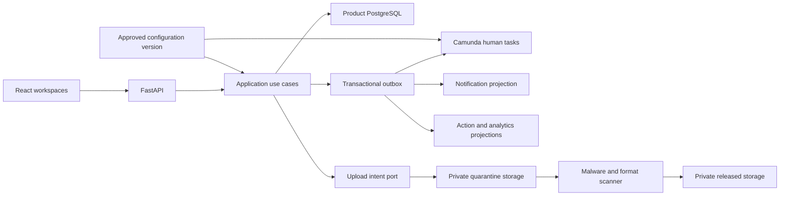

# ISTARI Service Next Product Expansion Plan

## Status and interpretation

Active implementation plan, accepted on 7 August 2026. No item in this plan is
implemented merely because it appears here. Completion requires the evidence
gates below.

The requested priority items are interpreted as:

- priority 3: notifications and personal work inboxes;
- priority 6: configurable organisation and workflow expansion;
- product improvement 1: role-specific daily workspaces;
- product improvement 2: a complete notification centre;
- secure dissemination: dashboard downloads for PDF, Word and PowerPoint products
  or a dashboard link to an approved external product;
- further improvement of organisation configuration, team planning and scoped
  statistics.

The governing product specification is
[`operational-product-evolution.md`](specs/operational-product-evolution.md).

## Current baseline

The product already has mandatory request submission, role-scoped queues,
Customer tracking, plain-text product download, feedback, Analyst clarification,
data-driven routing, explicit management grants, calendars, team workspaces,
workflow-derived Kanban, work packages and content-free statistics.

This plan extends those foundations. It does not rebuild them or relabel existing
evidence as evidence for the new capabilities.

| Capability | Current state | Planned change |
| --- | --- | --- |
| Daily work | Separate role queues and workspaces | One personal action workspace with saved views and safe deep links |
| Notifications | In-application states only | Durable, auditable notification centre and reminder policy |
| Dissemination | Authenticated plain-text download | Versioned managed PDF, DOCX and PPTX files or approved HTTPS links |
| Organisation | Data-driven seeded hierarchy | Draft, validate, approve and activate effective-dated versions |
| Workflow | Vetted generic human BPMN | Bounded declarative templates associated with approved BPMN versions |
| Team planning | Calendar, board, packages, WIP and iterations | Combined planning cockpit, scenarios, templates and richer signals |
| Statistics | Scoped operational measures | Comparisons, bottlenecks, capacity, dissemination and controlled exports |

## Delivery principles

1. Preserve the human route and approval model.
2. Add no direct React-to-Camunda or React-to-object-store trust path.
3. Keep binaries out of PostgreSQL and all buckets private.
4. Apply authorisation in the final database transaction and again on every
   product download or redirect.
5. Use configuration snapshots for new requests and pin in-flight requests.
6. Build projections from authoritative events, with idempotent repair and
   visible freshness.
7. Ship each vertical slice behind a disabled-by-default release flag until its
   migration, security, accessibility, recovery and browser evidence passes.

## Target architecture

New application services depend on small notification, object storage, scanner,
link policy, configuration, workflow, audit and clock ports. SQLAlchemy, object
storage, scanner and Camunda adapters remain replaceable infrastructure details.

## Required design records

Before feature code starts:

- accept the new product specification;
- create an ADR for action projections and notification delivery;
- create an ADR for quarantined object storage, scanning and authenticated
  dissemination;
- create an ADR for effective-dated configuration activation and in-flight
  version pinning;
- update the service-request workflow threat model for files and safe redirects;
- update the administration threat model for configuration approval;
- update the team-workspace and analytics threat models; and
- create a separate product-evolution Definition of Done matrix so the accepted
  MVP record is not overwritten.

Open decisions that require named owners are:

- maximum file size and total release-package size;
- production object-store region, encryption key owner and retention policy;
- malware scanner, update and quarantine ownership;
- approved external product domains and expiry rules;
- configuration approver membership and emergency rollback authority;
- reminder windows, service hours and notification retention; and
- whether aggregate CSV and PDF exports are permitted in the target environment.

## Implementation phases

### Phase 0: Rebaseline, decisions and feature boundaries

Deliverables:

- accept the specification and ADRs above;
- define the exact permission and notification-recipient matrices;
- define release artefact lifecycle states and scanner failure policy;
- define organisation and workflow configuration schemas;
- record visual, content and interaction theses for each new page;
- add planned API contracts to OpenAPI before frontend implementation; and
- establish feature flags, evidence locations and rollback owners.

Exit criteria:

- no unresolved ambiguity remains about product recipients, file handling,
  external-link ownership, configuration approval or in-flight version behaviour;
- all non-goals and production dependencies are explicit; and
- threat-model abuse cases have an assigned test layer.

### Phase 1: Shared persistence and projection foundations

Planned migrations:

1. `0012_action_notifications`: notification event, recipient, preference,
   action projection, saved view and projection checkpoint records.
2. `0013_product_artifacts`: release package, artefact, upload intent, scan,
   external link, dissemination recipient and access event records.
3. `0014_configuration_versions`: configuration version, unit revision,
   hierarchy edge, candidate-group mapping, workflow template, validation finding,
   approval and activation records.
4. `0015_planning_analytics_extensions`: package template, planning scenario and
   versioned analytics fact extensions.

Each migration must pass empty upgrade, previous-revision upgrade, drift check,
downgrade where safe, re-upgrade and rollback rehearsal on PostgreSQL.

Backfill rules:

- current organisation fixtures become immutable configuration version 1;
- existing requests retain their stored path and are pinned to version 1;
- existing plain-text products become historical `LEGACY_TEXT` release artefacts
  served by the existing authorised endpoint;
- no historical notification is invented, but current actionable state appears
  in `My work`; and
- current calendars, packages, management grants and analytics facts retain
  their identifiers and history.

Exit criteria:

- repositories prove exact scope, optimistic concurrency and idempotency;
- failed projections repair without duplicates; and
- no application route exposes the new records until its feature flag is enabled.

### Phase 2: Role-specific `My work` workspace

Backend work:

- implement one action-query service that merges current workflow tasks,
  clarification duties, release actions, feedback duties and safe operational
  exceptions;
- keep action-type adapters separate so each source retains authority;
- define stable action IDs, source versions, due-risk calculation and freshness;
- add keyset pagination, bounded filters and saved-view repositories; and
- recheck object and scope policy when creating every deep link response.

Frontend work:

- add `My work` as the default authenticated landing page;
- render `Needs my action`, `Waiting`, `Due soon` and `Recently completed` using
  the existing ISTARI table and status language;
- add role-appropriate filters, columns and saved views;
- preserve route focus and announce refreshed counts accessibly; and
- implement loading, empty, stale, conflict, permission-loss and degraded states.

Tests and evidence:

- positive and negative action matrices for every representative role;
- cross-Customer, sibling-team, ancestor, revoked-grant and ended-membership
  denials;
- pagination stability while work changes concurrently;
- keyboard, 200 per cent zoom, 390-pixel width and supported-browser journeys;
- p95 below two seconds at the existing pilot load; and
- proof that action state cannot move a request without its named use case.

Exit criteria:

- every role completes its ordinary daily journey from `My work`; and
- the existing role queues remain available during rollout but produce the same
  authorised results.

### Phase 3: Durable notification centre

Backend work:

- publish notification-worthy domain events in the same transaction as each
  authoritative change;
- project recipients through explicit policy, stable idempotency keys and the
  existing outbox/reconciliation pattern;
- implement unread, read, archived and action-completed states;
- implement mandatory and configurable event groups plus due-date reminders;
- add bounded list, count, preference and bulk read/archive endpoints; and
- provide live refresh with bounded polling fallback and observable projection
  lag.

Frontend work:

- add a header unread count and full notification centre;
- show event type, safe subject, age and action status without content excerpts;
- link to the corresponding authorised action or explain that access ended;
- support filters, preferences, mark-read and archive; and
- integrate notifications into `My work` without duplicating task ownership.

Tests and evidence:

- one notification per event and recipient under replay, retry and concurrency;
- exact recipient tests for routing, assignment, clarification, review, release,
  feedback, membership, capacity and configuration events;
- content-leak tests for request text, clarification messages, product names,
  private calendar text, tokens and Customer identities;
- revoked access and disabled-account behaviour;
- projection outage, repair and stale-state browser evidence; and
- notification visibility within ten seconds at the agreed pilot load.

Exit criteria:

- all specified events are durable, correctly scoped and auditable; and
- users can identify and reach every pending personal action without checking
  multiple queues manually.

### Phase 4: Managed products and dashboard dissemination

Backend work:

- implement release package and immutable artefact version use cases;
- implement object-store and scanner ports with local adapters and production
  configuration contracts;
- issue short-lived, single-purpose upload intents into a private quarantine
  location;
- validate size, extension, media type, magic bytes, Office package structure,
  encryption and active content before malware scanning;
- promote only clean PDF, DOCX and PPTX objects to private released storage;
- validate external HTTPS links against an approved domain policy without
  fetching them;
- bind Manager approval and QC dissemination to the exact package checksum and
  version;
- add authenticated download and safe redirect endpoints with access auditing;
  and
- add replacement, withdrawal, expiry, retention and orphan-cleanup jobs.

Frontend work:

- give Analysts a package builder with scan and validation status;
- give Managers and QC an immutable artefact review panel;
- prevent approval while an artefact is quarantined, failed or changed;
- put `Product available` and the artefact list on Customer `My requests` and
  request detail immediately after dissemination;
- show `Download` for managed files and `Open product` with destination domain
  for approved external links; and
- show replaced, withdrawn, expired and temporarily unavailable states safely.

Tests and evidence:

- clean PDF, DOCX and PPTX journeys through upload, scan, Manager review, QC
  release and Customer dashboard access;
- extension and magic-byte mismatch, macro content, archive bomb, encrypted
  Office package, oversize, malware, scan timeout and orphan upload cases;
- unreleased, cross-Customer, Platform Administrator, unrelated-team, replaced
  and withdrawn access denials;
- malicious URL, non-HTTPS, embedded credentials, disallowed domain, private
  address and expired-link cases;
- object-store and scanner interruption, retry, quarantine and cleanup recovery;
- safe filename, `no-store`, `nosniff`, disposition and redirect-header tests;
- captured-log and audit minimisation review; and
- current Chrome, Edge and Firefox Customer journeys.

Exit criteria:

- every disseminated artefact is traceable to its immutable reviewed version;
- the Customer can use its dashboard link while no public object URL exists; and
- no failed or unknown scan result can reach Manager approval or QC release.

### Phase 5: Configurable organisation and workflow expansion

Backend work:

- implement draft, validation, review, approval, activation, rejection and
  supersession use cases for configuration versions;
- model effective-dated unit revisions and edges while preserving stable unit
  identifiers and historical names;
- validate unit kinds, level order, cycles, route completeness, candidate groups,
  staffing and management grants;
- add a deterministic preview that reports added, moved, renamed, retired,
  unstaffed and permission-affected units;
- require step-up authentication, reason and different-actor approval for
  activation;
- compile only an allow-listed declarative workflow template and associate it
  with an already deployed compatible BPMN version;
- atomically activate a version for new requests; and
- pin organisation, form, workflow and notification-policy versions at request
  submission.

Frontend work:

- add an organisation tree editor using explicit forms and keyboard controls;
- add create, rename, move and retire previews without deleting referenced units;
- add validation findings with direct links to the affected unit;
- add workflow-template and approved-domain configuration forms;
- add review, comparison, approval and activation history pages; and
- distinguish `Awaiting staffing` as a valid operational state, not a fake route.

Camunda work:

- keep one generic human-led process family with stable variables;
- validate candidate-group mappings before configuration activation;
- deploy new BPMN versions through the operator-controlled deployment path;
- start new requests against the template's approved process definition; and
- leave in-flight instances on their original versions unless a future migration
  specification is separately accepted.

Tests and evidence:

- cycle, orphan, skipped-level, duplicate, invalid-group and no-complete-route
  validation;
- concurrent edit and activation one-winner behaviour;
- same-actor approval denial, expired step-up and unauthorised admin cases;
- historical rename, move, retire and current-versus-as-of queries;
- activation rollback by superseding version, not destructive reversal;
- live Camunda completion through a newly configured sibling branch using its own
  Manager and Analyst groups; and
- an existing in-flight request completing on its pinned earlier configuration.

Exit criteria:

- a valid branch can be created and activated without application code changes;
- arbitrary executable workflow content cannot enter through administration; and
- new and existing requests follow their correct, independently provable versions.

### Phase 6: Team planning enhancement

Backend work:

- add package templates, checklist instances, blocker ageing and planning
  scenarios;
- combine existing calendar availability, memberships, service work, packages
  and reservations in a versioned capacity preview;
- add iteration commitment and factual completion projections;
- keep reassignment and handover transactional and human-approved; and
- publish safe planning notification and analytics events.

Frontend work:

- add the `Planning cockpit` using the existing board, calendar and table
  components;
- add swimlanes, package templates, blocker and dependency views;
- show capacity scenarios and conflicts before commitment;
- provide drag and keyboard-equivalent commands; and
- show estimates, source freshness and the fact that recommendations are
  advisory.

Tests and evidence:

- capacity across leave, commitments, recurrence, transfer and reassignment;
- WIP and reservation concurrency;
- dependency cycles, blocker ageing and iteration boundary cases;
- exact-team, sibling and expired-grant permissions;
- no direct board mutation of Camunda state; and
- performance against the existing 5,000-occurrence and 2,500-package fixture.

Exit criteria:

- Managers can plan and rebalance transparently without automated assignment or
  a second workflow authority; and
- Analysts see their own commitments and team plan without inappropriate
  individual comparison.

### Phase 7: Statistics enhancement

Backend work:

- version analytics definitions and add dissemination, notification, planning and
  capacity fact types;
- add period comparison, bottleneck, ageing and trend queries;
- implement deterministic demand and capacity projections with confidence and
  freshness metadata, never automatic decisions;
- add controlled aggregate export use cases with the same grant, date, cohort and
  query bounds as screen APIs; and
- add projection rebuild, lag monitoring and integrity checks.

Frontend work:

- add period comparisons, bottleneck tables, capacity trends, release-cycle and
  unresolved-action views;
- keep scope, time zone, date range, definition, freshness and suppression next
  to every result;
- provide chart, table and textual summary parity;
- add audited aggregate export only where policy permits; and
- avoid individual Analyst ranking or content-derived reporting.

Tests and evidence:

- JIOC, command, Ops, team and Platform Administrator grant matrices;
- direct, descendant, ancestor, sibling, revoked and expired cases;
- historical organisation-version and retired-unit attribution;
- cohort suppression, export parity and formula oracle tests;
- projection rebuild and lag behaviour; and
- p95 below two seconds for bounded reads at the agreed fixture scale.

Exit criteria:

- every measure is reproducible from content-free facts and visible only within
  the active grant; and
- exports cannot expand the user's screen authority or bypass suppression.

### Phase 8: Integrated assurance and controlled rollout

- run the full existing regression suite plus the new permission, file, link,
  configuration and analytics matrices;
- retain at least 95 per cent line and branch coverage independently for backend
  and frontend application code;
- pass formatting, lint, typing, build, terminology, line, OpenAPI and BPMN gates;
- pass dependency, static, secret, licence, container and object-scanner checks;
- rehearse database, object metadata and configuration backup and restore;
- rehearse Camunda, database, object store, scanner and projection interruptions;
- run complete role journeys in current Chrome, Edge and Firefox at desktop and
  narrow widths;
- complete keyboard, focus, 200 per cent zoom, reduced motion and chart-table
  review;
- run the existing pilot load plus release download and notification workloads;
- update user, administrator, QC and operator guidance; and
- obtain named product, security, operational and representative-user acceptance.

Rollout order:

1. enable `My work` for OSG and the two Customer fixtures;
2. enable in-application notifications for the same cohort;
3. enable managed products for PDF only, then DOCX and PPTX after format evidence;
4. enable approved external links for a narrow domain allow-list;
5. enable configuration editing in read-only preview, then controlled activation;
6. enable planning and statistics enhancements per management grant; and
7. expand to sibling branches after one complete alternative-route rehearsal.

Rollback disables the affected feature flag and creates a superseding
configuration where required. It must not delete product, notification,
configuration, planning, analytics or audit history.

## API contract outline

The exact paths are confirmed during Phase 0, but the boundary must provide:

| Area | Contract responsibility |
| --- | --- |
| `me/actions` | Scoped action list, counts, filters, saved views and freshness |
| `me/notifications` | List, count, state changes and preferences |
| `product-packages` | Versioned packages, upload intents, scan state and review |
| `releases` | QC dissemination, Customer downloads and safe external redirects |
| `admin/configuration` | Draft, validate, compare, approve, activate and history |
| `team/planning` | Templates, scenarios, capacity previews and iteration summaries |
| `statistics` | Versioned scoped measures, tables, summaries and controlled exports |

All mutations require CSRF protection, expected version and idempotency where a
retry could duplicate an external effect. Identifiers from the client never
serve as proof of scope.

## Operational measures

The release should monitor, without content:

- action and notification projection lag, failures and reconciliation age;
- notification creation-to-visible latency and unread ageing;
- upload-intent expiry, quarantine age, scan failures and orphan cleanup;
- download and redirect success, denial and unavailable rates;
- configuration validation, activation and rollback outcomes;
- object-store, scanner, PostgreSQL and Camunda dependency health;
- planning and analytics projection freshness; and
- API latency and error rate by bounded operation name.

Alerts need a named owner, severity, response target and safe diagnostic runbook
before the corresponding feature is enabled.

## Security review focus

The mandatory abuse review includes broken object-level access, forged upload
keys, path traversal, malicious filenames, MIME confusion, archive expansion,
macro content, malware, encrypted files, stale scan results, public bucket
exposure, unsafe redirects, link allow-list bypass, notification leakage,
configuration privilege escalation, hierarchy cycles, candidate-group injection,
cross-version confusion, analytics inference and export misuse.

No feature is accepted with an unresolved high or critical finding. Medium risks
require an owner, expiry and documented disposition.

## Programme completion

The plan is complete only when each phase has:

- an accepted specification and applicable ADR and threat-model updates;
- migrated and recoverable data;
- backend and frontend behaviour with negative access tests;
- current coverage, security, accessibility, browser and performance evidence;
- updated operator and user documentation;
- a clean Git review and hosted CI result; and
- named acceptance.

Until then, the existing MVP remains the truthful product baseline and these
capabilities remain planned work.
