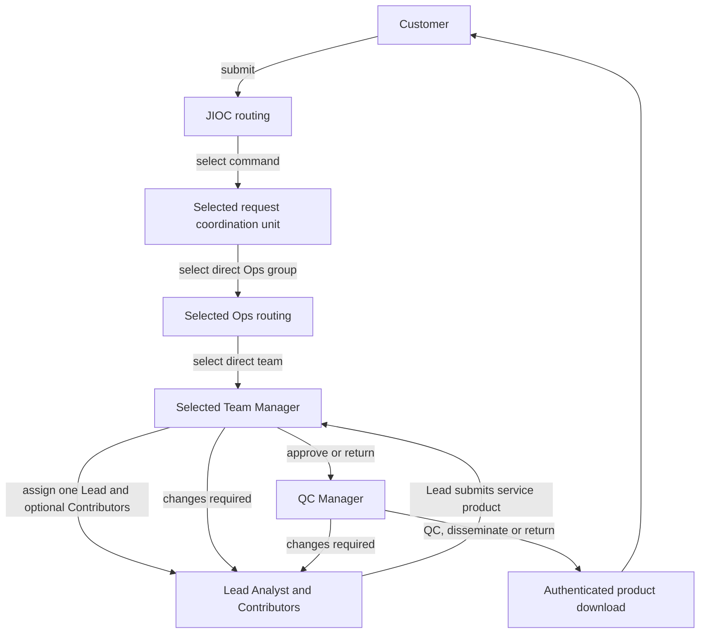

# Organisation and Routing Model

## MVP workflow

Customers submit into JIOC. Named routing users select each destination down the
hierarchy. Once a team receives the work, the product does not travel back up the
routing chain for approval.



Every route and outcome is a human action. Camunda coordinates user tasks using
stable organisation identifiers. It does not select, recommend or infer a route.

JIOC, the selected command and the selected Ops group keep read-only tracking
visibility after routing. The register identifies each request by title and
reference, and renders both the selected organisation route and the delivery
lifecycle. An exact-route member may reopen the Customer's submitted request in
a separate read-only view. That view does not expose workflow actions, Analyst
clarifications, feedback, product metadata, files or links. These routing levels
do not approve the service product. The Team Manager checks the Analyst's work,
and the QC Manager performs final quality control and dissemination to the
Customer. One Lead Analyst remains the accountable Camunda assignee. Up to ten
Contributors can see the request and collaborate, but cannot complete the
parent workflow task.

The Customer dashboard exposes an authenticated download for a released PDF,
DOCX or PPTX file, or an authenticated redirect to a normalised allow-listed
HTTPS product. Files pass quarantine, structural validation and malware scanning
before they can enter review. The backend never fetches an analyst-supplied URL,
and withdrawal prevents legacy download fallback.

At each routing stage, the application presents only effective direct children
of the current route. The current small hierarchy uses explicit select controls;
the enterprise-scale experience is specified to add literal name/code search
without ranking or recommendation. Staffing state is factual guidance and does
not disable a valid choice or trigger automatic fallback.

Platform Administrators see a guided **Current configuration** and **Proposed
changes** workspace. Search retains ancestor context, the selected unit shows a
root-to-unit breadcrumb, and create/move forms list only effective parents of the
correct kind. Complete FastAPI validation remains authoritative. Immutable
revisions, independent approval and request pins remain internal controls even
though the page does not require operators to understand version or draft terms.

## Reporting visibility

Statistics use the same stored organisation closure as routing, but a statistics
grant is independent of workflow-task ownership. A reporting request names a
grant root and a selected node. The selected node must be the root or one of its
configured descendants. Parents and sibling branches are not returned.

```text
JIOC grant       -> JIOC, DIGOC, SYGOC, MYGOC and everything below them
DIGOC grant      -> DIGOC, its Ops groups and their teams only
NCGI-A Ops grant -> NCGI-A Ops, OSG, Cedar and Quartz only
OSG Team grant   -> OSG Team only
```

Users with several explicit grants see several separate reporting roots. For
example, the shared command-routing fixture has independent DIGOC, SYGOC and
MYGOC grants to exercise all branches. Selecting DIGOC never makes SYGOC or
MYGOC traversable from that scope. Platform Administrators use the JIOC root and
can select any configured descendant for content-free service health. The QC
Manager has an explicit JIOC statistics grant for the shared quality overview.

Landing pages show only a small operational summary. Detailed trends,
definitions, date controls, hierarchy breadcrumbs and export policy remain in
Statistics. My actions remains the staff action register, and My requests remains the
Customer register.

The Statistics workspace renders current status, due risk and active-age
distributions as restrained donut charts. Completed stage duration compares the
median with the 90th percentile as a range graphic. These are presentational
views over the already authorised aggregate response: the same rows remain
available as labelled tables, and no browser-side hierarchy filter broadens the
server-selected scope.

## Organisation tree

JIOC is the single root. Every unit below is seeded reference data, is staffed
and is a valid selectable routing destination where its parent owns the current
route. Every unit is also a workspace with effective-dated Manager and Member
positions. Routing workspaces use those positions for roster, calendar and
workspace stewardship only. Both Managers and Members make routing decisions by
claiming the same Camunda task, so Manager status adds no approval or allocation
stage. Delivery-team Managers additionally control Analyst assignment, team
calendar commitments, board planning and capacity.

The organisation page reports factual staffing for every unit, including JIOC,
commands and Ops groups. A unit remains selectable if temporarily unstaffed, and
the tracker reports that condition without silently routing elsewhere.

```text
JIOC [STAFFED WORKSPACE]
├── DIGOC [STAFFED WORKSPACE]
│   ├── NCGI-A Ops [STAFFED WORKSPACE]
│   │   ├── OSG Team [STAFFED WORKSPACE]
│   │   │   ├── OSG Manager
│   │   │   └── OSG Analyst
│   │   ├── Cedar Team [STAFFED WORKSPACE]
│   │   └── Quartz Team [STAFFED WORKSPACE]
│   ├── Aurora Ops [STAFFED WORKSPACE]
│   │   ├── Lantern Team [STAFFED WORKSPACE]
│   │   ├── Mosaic Team [STAFFED WORKSPACE]
│   │   └── Compass Team [STAFFED WORKSPACE]
│   └── Vertex Ops [STAFFED WORKSPACE]
│       ├── Ember Team [STAFFED WORKSPACE]
│       ├── Atlas Team [STAFFED WORKSPACE]
│       └── Harbour Team [STAFFED WORKSPACE]
├── SYGOC [STAFFED WORKSPACE]
│   ├── Nimbus Ops [STAFFED WORKSPACE]
│   │   ├── Beacon Team [STAFFED WORKSPACE]
│   │   ├── Slate Team [STAFFED WORKSPACE]
│   │   └── Orchard Team [STAFFED WORKSPACE]
│   ├── Parallax Ops [STAFFED WORKSPACE]
│   │   ├── Lumen Team [STAFFED WORKSPACE]
│   │   ├── Northstar Team [STAFFED WORKSPACE]
│   │   └── Copper Team [STAFFED WORKSPACE]
│   └── Horizon Ops [STAFFED WORKSPACE]
│       ├── Rowan Team [STAFFED WORKSPACE]
│       ├── Vela Team [STAFFED WORKSPACE]
│       └── Keel Team [STAFFED WORKSPACE]
└── MYGOC [STAFFED WORKSPACE]
    ├── Meridian Ops [STAFFED WORKSPACE]
    │   ├── Flint Team [STAFFED WORKSPACE]
    │   ├── Thistle Team [STAFFED WORKSPACE]
    │   └── Granite Team [STAFFED WORKSPACE]
    ├── Solstice Ops [STAFFED WORKSPACE]
    │   ├── Kestrel Team [STAFFED WORKSPACE]
    │   ├── Juniper Team [STAFFED WORKSPACE]
    │   └── Vale Team [STAFFED WORKSPACE]
    └── Frontier Ops [STAFFED WORKSPACE]
        ├── Tidal Team [STAFFED WORKSPACE]
        ├── Grove Team [STAFFED WORKSPACE]
        └── Prism Team [STAFFED WORKSPACE]
```

The names outside the user-specified JIOC, DIGOC, NCGI-A Ops and OSG Team route
are fictional public-safe fixtures. They are first-class workflow configuration,
not demonstration-only placeholders, and the application never disables or
visually downgrades them as routing choices.

## Representative role mapping

| Product role | Initial scope | Responsibility |
| --- | --- | --- |
| Customer | Outside JIOC | Submit, track, respond, download and give feedback |
| JIOC Routing User | JIOC | Intake, clarification, closure and command selection |
| Request Coordination User | Shared request coordination | Select a direct Ops group for any configured command and track progress |
| Ops Routing User | Shared Ops routing | Select a direct team for any configured Ops group and track progress |
| Team Manager | One configured team | Assign one Lead and optional Contributors, maintain the team and check the submitted product |
| Team Analyst | One configured team | Produce, collaborate on and resubmit the service product |
| QC Manager | Shared QC function | Perform final QC and disseminate the download link |

OSG is the initial operational delivery team and has additional staff. Every
sibling team has a synthetic Manager and Analyst so a complete alternative route
can be exercised. Teams never borrow OSG users.

## Complete synthetic user directory

The local/test product contains the following 99 users. The original 73 accounts
remain unchanged. Accounts `admin74` to `admin99` add one named Manager and one
named Member to every routing workspace. Every account uses its sequential logon
and the local-only password `admin`. All accounts start active except `admin16`,
which is intentionally inactive for access-control testing.
Names are synthetic fixtures borrowed from Scottish football and do not describe
the real people. The machine-readable source of truth is `DEMO_IDENTITIES` in
`apps/api/src/istari_service/demo_seed.py`. The directory below deliberately
enumerates every account. Automated seed tests assert the count of 99, the exact
`admin1` to `admin99` sequence, unique display names, role totals, Manager and
Member coverage in every routing unit, and active Manager and Analyst coverage
in every delivery team.

| Logon | Display name | Representative role | Organisational assignment | Initial state |
| --- | --- | --- | --- | --- |
| `admin1` | Andy Robertson | Platform Administrator | Platform support | Active |
| `admin2` | John McGinn | Customer | Customer | Active |
| `admin3` | Billy Gilmour | Customer | Customer | Active |
| `admin4` | Scott McTominay | JIOC Routing User, Manager | JIOC | Active |
| `admin5` | Callum McGregor | Request Coordination User, Manager | DIGOC, SYGOC and MYGOC | Active |
| `admin6` | Kieran Tierney | Ops Routing User, Manager | NCGI-A Ops, Aurora Ops, Vertex Ops, Nimbus Ops and Parallax Ops | Active |
| `admin7` | Ryan Christie | JIOC Routing User, Member | JIOC | Active |
| `admin8` | Grant Hanley | Team Manager | OSG Team | Active |
| `admin9` | Kenny McLean | Team Manager | OSG Team | Active |
| `admin10` | Craig Gordon | Ops Routing User, Member | Horizon Ops, Meridian Ops, Solstice Ops and Frontier Ops | Active |
| `admin11` | Lewis Ferguson | Team Analyst | OSG Team | Active |
| `admin12` | Nathan Patterson | Team Analyst | OSG Team | Active |
| `admin13` | Ben Doak | Team Analyst | OSG Team | Active |
| `admin14` | Che Adams | Team Analyst | OSG Team | Active |
| `admin15` | Angus Gunn | QC Manager | Shared QC | Active |
| `admin16` | James Forrest | Customer | Customer | Inactive |
| `admin17` | Lawrence Shankland | Team Manager | OSG Team | Active |
| `admin18` | Tommy Conway | Team Analyst | OSG Team | Active |
| `admin19` | Steve Clarke | Team Analyst | OSG Team | Active |
| `admin20` | Derek McInnes | Team Analyst | OSG Team | Active |
| `admin21` | Kenny Dalglish | Team Manager | Cedar Team | Active |
| `admin22` | Denis Law | Team Analyst | Cedar Team | Active |
| `admin23` | Graeme Souness | Team Manager | Quartz Team | Active |
| `admin24` | Alan Hansen | Team Analyst | Quartz Team | Active |
| `admin25` | Gordon Strachan | Team Manager | Lantern Team | Active |
| `admin26` | Ally McCoist | Team Analyst | Lantern Team | Active |
| `admin27` | Darren Fletcher | Team Manager | Mosaic Team | Active |
| `admin28` | James McFadden | Team Analyst | Mosaic Team | Active |
| `admin29` | Barry Ferguson | Team Manager | Compass Team | Active |
| `admin30` | Paul McStay | Team Analyst | Compass Team | Active |
| `admin31` | Gary McAllister | Team Manager | Ember Team | Active |
| `admin32` | John Collins | Team Analyst | Ember Team | Active |
| `admin33` | Kevin Gallacher | Team Manager | Atlas Team | Active |
| `admin34` | Colin Hendry | Team Analyst | Atlas Team | Active |
| `admin35` | Alex McLeish | Team Manager | Harbour Team | Active |
| `admin36` | Willie Miller | Team Analyst | Harbour Team | Active |
| `admin37` | Joe Jordan | Team Manager | Beacon Team | Active |
| `admin38` | Archie Gemmill | Team Analyst | Beacon Team | Active |
| `admin39` | Dave Mackay | Team Manager | Slate Team | Active |
| `admin40` | Billy Bremner | Team Analyst | Slate Team | Active |
| `admin41` | Jim Baxter | Team Manager | Orchard Team | Active |
| `admin42` | Danny McGrain | Team Analyst | Orchard Team | Active |
| `admin43` | Jimmy Johnstone | Team Manager | Lumen Team | Active |
| `admin44` | Bobby Lennox | Team Analyst | Lumen Team | Active |
| `admin45` | John Greig | Team Manager | Northstar Team | Active |
| `admin46` | Sandy Jardine | Team Analyst | Northstar Team | Active |
| `admin47` | Maurice Johnston | Team Manager | Copper Team | Active |
| `admin48` | Gordon Durie | Team Analyst | Copper Team | Active |
| `admin49` | Stuart McCall | Team Manager | Rowan Team | Active |
| `admin50` | Neil McCann | Team Analyst | Rowan Team | Active |
| `admin51` | Don Hutchison | Team Manager | Vela Team | Active |
| `admin52` | Christian Dailly | Team Analyst | Vela Team | Active |
| `admin53` | Gary Naysmith | Team Manager | Keel Team | Active |
| `admin54` | Lee McCulloch | Team Analyst | Keel Team | Active |
| `admin55` | Steven Naismith | Team Manager | Flint Team | Active |
| `admin56` | Charlie Adam | Team Analyst | Flint Team | Active |
| `admin57` | Robert Snodgrass | Team Manager | Thistle Team | Active |
| `admin58` | Steven Fletcher | Team Analyst | Thistle Team | Active |
| `admin59` | James Morrison | Team Manager | Granite Team | Active |
| `admin60` | Shaun Maloney | Team Analyst | Granite Team | Active |
| `admin61` | Barry Bannan | Team Manager | Kestrel Team | Active |
| `admin62` | David Marshall | Team Analyst | Kestrel Team | Active |
| `admin63` | Allan McGregor | Team Manager | Juniper Team | Active |
| `admin64` | Stephen O'Donnell | Team Analyst | Juniper Team | Active |
| `admin65` | Lyndon Dykes | Team Manager | Vale Team | Active |
| `admin66` | Ryan Porteous | Team Analyst | Vale Team | Active |
| `admin67` | Jack Hendry | Team Manager | Tidal Team | Active |
| `admin68` | Aaron Hickey | Team Analyst | Tidal Team | Active |
| `admin69` | Scott McKenna | Team Manager | Grove Team | Active |
| `admin70` | Greg Taylor | Team Analyst | Grove Team | Active |
| `admin71` | Ryan Jack | Team Manager | Prism Team | Active |
| `admin72` | Stuart Armstrong | Team Analyst | Prism Team | Active |
| `admin73` | Jim Leighton | Platform Administrator | Platform configuration approval | Active |
| `admin74` | Alan Rough | JIOC Routing User, Manager | JIOC | Active |
| `admin75` | Willie Ormond | JIOC Routing User, Member | JIOC | Active |
| `admin76` | Craig Levein | Request Coordination User, Manager | DIGOC | Active |
| `admin77` | Walter Smith | Request Coordination User, Member | DIGOC | Active |
| `admin78` | Alex Ferguson | Request Coordination User, Manager | SYGOC | Active |
| `admin79` | Tommy Burns | Request Coordination User, Member | SYGOC | Active |
| `admin80` | Jock Stein | Request Coordination User, Manager | MYGOC | Active |
| `admin81` | Bill Shankly | Request Coordination User, Member | MYGOC | Active |
| `admin82` | Willie Johnston | Ops Routing User, Manager | NCGI-A Ops | Active |
| `admin83` | Asa Hartford | Ops Routing User, Member | NCGI-A Ops | Active |
| `admin84` | Craig Burley | Ops Routing User, Manager | Aurora Ops | Active |
| `admin85` | Kevin Thomson | Ops Routing User, Member | Aurora Ops | Active |
| `admin86` | Scott Brown | Ops Routing User, Manager | Vertex Ops | Active |
| `admin87` | Kris Boyd | Ops Routing User, Member | Vertex Ops | Active |
| `admin88` | Kenny Miller | Ops Routing User, Manager | Nimbus Ops | Active |
| `admin89` | Garry O'Connor | Ops Routing User, Member | Nimbus Ops | Active |
| `admin90` | David Weir | Ops Routing User, Manager | Parallax Ops | Active |
| `admin91` | Russell Anderson | Ops Routing User, Member | Parallax Ops | Active |
| `admin92` | Gary Caldwell | Ops Routing User, Manager | Horizon Ops | Active |
| `admin93` | Steven Caldwell | Ops Routing User, Member | Horizon Ops | Active |
| `admin94` | Lee Wallace | Ops Routing User, Manager | Meridian Ops | Active |
| `admin95` | Ross McCormack | Ops Routing User, Member | Meridian Ops | Active |
| `admin96` | Mark Burchill | Ops Routing User, Manager | Solstice Ops | Active |
| `admin97` | Nigel Quashie | Ops Routing User, Member | Solstice Ops | Active |
| `admin98` | Matt Ritchie | Ops Routing User, Manager | Frontier Ops | Active |
| `admin99` | Oliver Burke | Ops Routing User, Member | Frontier Ops | Active |

## Selection and authorisation

All authorised routing users at the current stage can select any direct child of
their scoped unit. “Selectable by all users” therefore means every applicable
routing user sees the complete valid child list. Customers, analysts, managers
and QC users cannot skip the chain or choose an unrelated branch.

Each organisation record has a stable ID, parent ID, kind and staffing status.
The backend validates the parent-child relationship, actor scope, current task
and request version before dispatch. The selected unit ID determines the next
Camunda candidate group. The tracker retains the complete selected path.

Expansion adds memberships to an existing selectable unit or adds new governed
units. It does not require a process definition per team. Existing process
instances retain the hierarchy and process versions with which they started.

## Required workflow proof

- Route one request through DIGOC → NCGI-A Ops → OSG Team and complete the full
  Analyst → Manager → QC Manager → Customer download journey.
- Complete a request through SYGOC → Nimbus Ops → Beacon Team using Beacon's
  distinct Manager and Analyst groups, with no OSG fallback.
- If account maintenance makes a destination unstaffed, show `Awaiting staffing`,
  not an error, completion or OSG work item.
- Reject non-child unit IDs, skipped levels, stale selections and attempts by a
  role that does not own the current routing task.
- Prove JIOC, command and Ops trackers can see progress metadata without gaining
  approval controls or access to unreleased product content.
