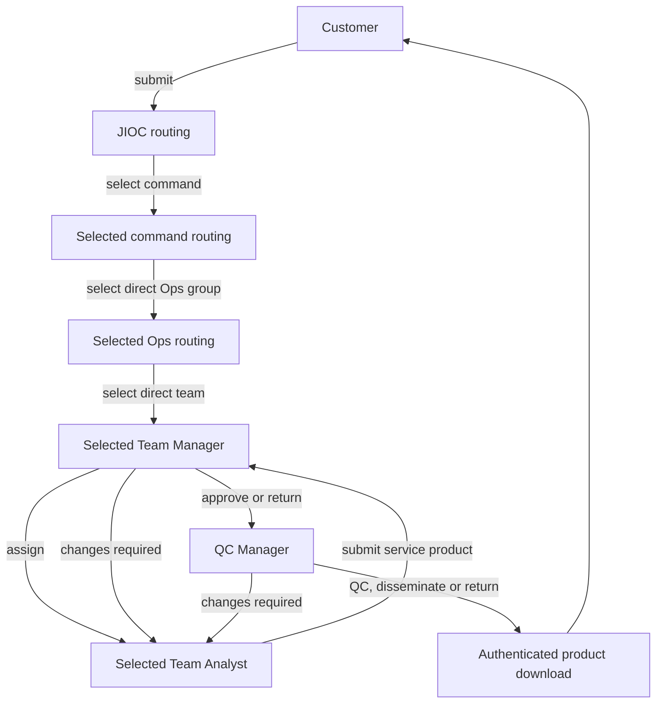

# Organisation and Routing Model

## MVP workflow

Customers submit into JIOC. Named routing users select each destination down the
hierarchy. Once a team receives the work, the product does not travel back up the
routing chain for approval.



Every route and outcome is a human action. Camunda coordinates user tasks using
stable organisation identifiers. It does not select, recommend or infer a route.

JIOC, the selected command and the selected Ops group keep read-only tracking
visibility after routing. They do not approve the service product. The Team
Manager checks the analyst's work, and the QC Manager performs final quality
control and dissemination to the customer.

The secure initial download is an authenticated link to the disseminated plain-text
product. The application never fetches an arbitrary analyst-supplied URL. Binary
files remain out of scope until upload quarantine, malware scanning and
controlled object storage are specified.

## Organisation tree

JIOC is the single root. Every child below is seeded reference data and is a
valid, selectable routing destination. `ROUTABLE` command and Ops nodes are
handled by shared routing pools, which lets any branch be exercised. `STAFFED`
means a delivery team has active Manager and Analyst users. The seed makes every
team staffed. If administration later removes either qualified role, the team
remains selectable and the tracker shows `Awaiting staffing` until membership is
restored.

```text
JIOC [ROUTABLE]
├── DIGOC [ROUTABLE]
│   ├── NCGI-A Ops [ROUTABLE]
│   │   ├── OSG Team [STAFFED]
│   │   │   ├── OSG Manager
│   │   │   └── OSG Analyst
│   │   ├── Cedar Team [STAFFED]
│   │   └── Quartz Team [STAFFED]
│   ├── Aurora Ops [ROUTABLE]
│   │   ├── Lantern Team [STAFFED]
│   │   ├── Mosaic Team [STAFFED]
│   │   └── Compass Team [STAFFED]
│   └── Vertex Ops [ROUTABLE]
│       ├── Ember Team [STAFFED]
│       ├── Atlas Team [STAFFED]
│       └── Harbour Team [STAFFED]
├── SYGOC [ROUTABLE]
│   ├── Nimbus Ops [ROUTABLE]
│   │   ├── Beacon Team [STAFFED]
│   │   ├── Slate Team [STAFFED]
│   │   └── Orchard Team [STAFFED]
│   ├── Parallax Ops [ROUTABLE]
│   │   ├── Lumen Team [STAFFED]
│   │   ├── Northstar Team [STAFFED]
│   │   └── Copper Team [STAFFED]
│   └── Horizon Ops [ROUTABLE]
│       ├── Rowan Team [STAFFED]
│       ├── Vela Team [STAFFED]
│       └── Keel Team [STAFFED]
└── MYGOC [ROUTABLE]
    ├── Meridian Ops [ROUTABLE]
    │   ├── Flint Team [STAFFED]
    │   ├── Thistle Team [STAFFED]
    │   └── Granite Team [STAFFED]
    ├── Solstice Ops [ROUTABLE]
    │   ├── Kestrel Team [STAFFED]
    │   ├── Juniper Team [STAFFED]
    │   └── Vale Team [STAFFED]
    └── Frontier Ops [ROUTABLE]
        ├── Tidal Team [STAFFED]
        ├── Grove Team [STAFFED]
        └── Prism Team [STAFFED]
```

The names outside the user-specified JIOC, DIGOC, NCGI-A Ops and OSG Team route
are fictional public-safe fixtures. They are first-class workflow configuration,
not demonstration-only placeholders, and the application never disables or
visually downgrades them as routing choices.

## Representative role mapping

| Product role | Initial scope | Responsibility |
| --- | --- | --- |
| Customer | Outside JIOC | Submit, track, respond, download and give feedback |
| JIOC Routing User | JIOC | Intake, clarification, closure and command selection |
| Command Routing User | Shared routing pool | Select a direct Ops group for any configured command and track progress |
| Ops Routing User | Shared routing pool | Select a direct team for any configured Ops group and track progress |
| Team Manager | One configured team | Assign an analyst and check the submitted product |
| Team Analyst | One configured team | Produce and resubmit the service product |
| QC Manager | Shared QC function | Perform final QC and disseminate the download link |

OSG is the initial operational delivery team and has additional staff. Every
sibling team has a synthetic Manager and Analyst so a complete alternative route
can be exercised. Teams never borrow OSG users.

## Complete synthetic user directory

The local/test product contains the following 73 users. The original MVP's 72
accounts remain unchanged, and `admin73` provides the independent configuration
approval identity required by the active product evolution. Every account uses its
sequential logon and the local-only password `admin`. All accounts start active
except `admin16`, which is intentionally inactive for access-control testing.
Names are synthetic fixtures borrowed from Scottish football and do not describe
the real people. The machine-readable source of truth is `DEMO_IDENTITIES` in
`apps/api/src/istari_service/demo_seed.py`. The directory below deliberately
enumerates every account. Automated seed tests assert the count of 73, the exact
`admin1` to `admin73` sequence, unique display names, role totals and at least one
active Manager and Analyst in every team.

| Logon | Display name | Representative role | Organisational assignment | Initial state |
| --- | --- | --- | --- | --- |
| `admin1` | Andy Robertson | Platform Administrator | Platform support | Active |
| `admin2` | John McGinn | Customer | Requesting Area A | Active |
| `admin3` | Billy Gilmour | Customer | Requesting Area B | Active |
| `admin4` | Scott McTominay | JIOC Routing User | JIOC | Active |
| `admin5` | Callum McGregor | Command Routing User | DIGOC, SYGOC and MYGOC | Active |
| `admin6` | Kieran Tierney | Ops Routing User | All configured Ops groups | Active |
| `admin7` | Ryan Christie | JIOC Routing User | JIOC | Active |
| `admin8` | Grant Hanley | Team Manager | OSG Team | Active |
| `admin9` | Kenny McLean | Team Manager | OSG Team | Active |
| `admin10` | Craig Gordon | Ops Routing User | All configured Ops groups | Active |
| `admin11` | Lewis Ferguson | Team Analyst | OSG Team | Active |
| `admin12` | Nathan Patterson | Team Analyst | OSG Team | Active |
| `admin13` | Ben Doak | Team Analyst | OSG Team | Active |
| `admin14` | Che Adams | Team Analyst | OSG Team | Active |
| `admin15` | Angus Gunn | QC Manager | Shared QC | Active |
| `admin16` | James Forrest | Customer | Requesting Area A | Inactive |
| `admin17` | Lawrence Shankland | Team Manager | OSG Team | Active |
| `admin18` | Tommy Conway | Team Analyst | OSG Team | Active |
| `admin19` | Steve Clarke | Team Analyst | OSG Team | Active |
| `admin20` | Derek McInnes | Team Analyst | OSG Team | Active |
| `admin21` | Kenny Dalglish | Team Manager | Cedar Team | Active |
| `admin22` | Denis Law | Team Analyst | Cedar Team | Active |
| `admin23` | Graeme Souness | Team Manager | Quartz Team | Active |
| `admin24` | Alan Hansen | Team Analyst | Quartz Team | Active |
| `admin25` | Gordon Strachan | Team Manager | Lantern Team | Active |
| `admin26` | Ally McCoist | Team Analyst | Lantern Team | Active |
| `admin27` | Darren Fletcher | Team Manager | Mosaic Team | Active |
| `admin28` | James McFadden | Team Analyst | Mosaic Team | Active |
| `admin29` | Barry Ferguson | Team Manager | Compass Team | Active |
| `admin30` | Paul McStay | Team Analyst | Compass Team | Active |
| `admin31` | Gary McAllister | Team Manager | Ember Team | Active |
| `admin32` | John Collins | Team Analyst | Ember Team | Active |
| `admin33` | Kevin Gallacher | Team Manager | Atlas Team | Active |
| `admin34` | Colin Hendry | Team Analyst | Atlas Team | Active |
| `admin35` | Alex McLeish | Team Manager | Harbour Team | Active |
| `admin36` | Willie Miller | Team Analyst | Harbour Team | Active |
| `admin37` | Joe Jordan | Team Manager | Beacon Team | Active |
| `admin38` | Archie Gemmill | Team Analyst | Beacon Team | Active |
| `admin39` | Dave Mackay | Team Manager | Slate Team | Active |
| `admin40` | Billy Bremner | Team Analyst | Slate Team | Active |
| `admin41` | Jim Baxter | Team Manager | Orchard Team | Active |
| `admin42` | Danny McGrain | Team Analyst | Orchard Team | Active |
| `admin43` | Jimmy Johnstone | Team Manager | Lumen Team | Active |
| `admin44` | Bobby Lennox | Team Analyst | Lumen Team | Active |
| `admin45` | John Greig | Team Manager | Northstar Team | Active |
| `admin46` | Sandy Jardine | Team Analyst | Northstar Team | Active |
| `admin47` | Maurice Johnston | Team Manager | Copper Team | Active |
| `admin48` | Gordon Durie | Team Analyst | Copper Team | Active |
| `admin49` | Stuart McCall | Team Manager | Rowan Team | Active |
| `admin50` | Neil McCann | Team Analyst | Rowan Team | Active |
| `admin51` | Don Hutchison | Team Manager | Vela Team | Active |
| `admin52` | Christian Dailly | Team Analyst | Vela Team | Active |
| `admin53` | Gary Naysmith | Team Manager | Keel Team | Active |
| `admin54` | Lee McCulloch | Team Analyst | Keel Team | Active |
| `admin55` | Steven Naismith | Team Manager | Flint Team | Active |
| `admin56` | Charlie Adam | Team Analyst | Flint Team | Active |
| `admin57` | Robert Snodgrass | Team Manager | Thistle Team | Active |
| `admin58` | Steven Fletcher | Team Analyst | Thistle Team | Active |
| `admin59` | James Morrison | Team Manager | Granite Team | Active |
| `admin60` | Shaun Maloney | Team Analyst | Granite Team | Active |
| `admin61` | Barry Bannan | Team Manager | Kestrel Team | Active |
| `admin62` | David Marshall | Team Analyst | Kestrel Team | Active |
| `admin63` | Allan McGregor | Team Manager | Juniper Team | Active |
| `admin64` | Stephen O'Donnell | Team Analyst | Juniper Team | Active |
| `admin65` | Lyndon Dykes | Team Manager | Vale Team | Active |
| `admin66` | Ryan Porteous | Team Analyst | Vale Team | Active |
| `admin67` | Jack Hendry | Team Manager | Tidal Team | Active |
| `admin68` | Aaron Hickey | Team Analyst | Tidal Team | Active |
| `admin69` | Scott McKenna | Team Manager | Grove Team | Active |
| `admin70` | Greg Taylor | Team Analyst | Grove Team | Active |
| `admin71` | Ryan Jack | Team Manager | Prism Team | Active |
| `admin72` | Stuart Armstrong | Team Analyst | Prism Team | Active |
| `admin73` | Jim Leighton | Platform Administrator | Platform configuration approval | Active |

## Selection and authorisation

All authorised routing users at the current stage can select any direct child of
their scoped unit. “Selectable by all users” therefore means every applicable
routing user sees the complete valid child list. Customers, analysts, managers
and QC users cannot skip the chain or choose an unrelated branch.

Each organisation record has a stable ID, parent ID, kind and staffing status.
The backend validates the parent-child relationship, actor scope, current task
and request version before dispatch. The selected unit ID determines the next
Camunda candidate group. The tracker retains the complete selected path.

Expansion adds memberships to an existing selectable unit or adds new governed
units. It does not require a process definition per team. Existing process
instances retain the hierarchy and process versions with which they started.

## Required workflow proof

- Route one request through DIGOC → NCGI-A Ops → OSG Team and complete the full
  Analyst → Manager → QC Manager → Customer download journey.
- Complete a request through SYGOC → Nimbus Ops → Beacon Team using Beacon's
  distinct Manager and Analyst groups, with no OSG fallback.
- If account maintenance makes a destination unstaffed, show `Awaiting staffing`,
  not an error, completion or OSG work item.
- Reject non-child unit IDs, skipped levels, stale selections and attempts by a
  role that does not own the current routing task.
- Prove JIOC, command and Ops trackers can see progress metadata without gaining
  approval controls or access to unreleased product content.
