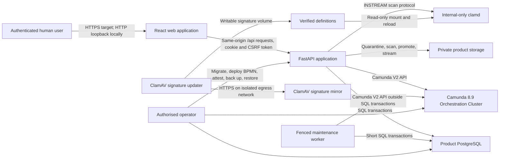

# ISTARI Service system architecture

Status: current implementation architecture and unimplemented target boundaries
Last reviewed: 10 August 2026

## 1. Purpose and scope

ISTARI Service is a human-led service-request application. A Customer submits a
structured request, authorised routing users select each organisational
destination, a Team Manager assigns one Lead Analyst and optional Contributors,
and QC releases a product for
authenticated download. Camunda coordinates human user tasks. It does not make
priority, route, assignment, approval or release decisions.

This document describes the executable React, FastAPI, PostgreSQL and Camunda
system. The organisation model is in
[Organisation and routing](ORGANISATION_AND_ROUTING.md). Detailed decisions are
in [ADRs 0001 to 0027](../adr/). Production gaps remain authoritative in the
[gap register](../ENTERPRISE_READINESS_GAP_REGISTER.md).

## 2. System context

The browser calls FastAPI only. It never calls Camunda or PostgreSQL. Application
code never reads Camunda-owned database tables. The local Compose deployment
shares one PostgreSQL server but creates separately owned application and
Camunda databases; that co-location is not a production recommendation.

## 3. Executable components

### React web application

The Vite/React/TypeScript application is in `apps/web`. React Router controls
navigation, TanStack Query owns server state, and feature folders contain pages
and focused presentation components. `lib/api` is the browser's typed transport
boundary. `lib/auth`, route policy, capabilities and status helpers keep shared
concerns out of feature pages.

The production image currently uses a small Nginx server that serves static
assets, applies browser security headers, forwards `/api/` to FastAPI and
supports client-side routing. That Nginx configuration recognises only local
hostnames and is part of the local topology. It is not the target ingress or TLS
termination design.

### FastAPI application

`apps/api/src/istari_service` is composed in `main.py`:

- `routers/` handles HTTP translation and dependencies;
- `schemas/` validates API requests and responses;
- `services/` coordinates application use cases;
- policy and projection modules contain framework-independent business rules;
- `repositories/` implements PostgreSQL reads and writes;
- `workflow/` adapts the Camunda V2 API to the internal workflow port;
- product storage, scanning and link-policy adapters implement product ports;
- maintenance, retention, restore verification and telemetry support operators.

`worker.py` is a separate executable composition root. Named PostgreSQL leases
fence singleton projection jobs, while existing row-level outbox leases permit
bounded parallel dispatch. A durable content-free heartbeat makes missing or
stale maintenance visible to API readiness.

The same fenced worker enriches transactionally created request-search
projections with 384-dimension FastEmbed vectors. The model is revision and
checksum verified at image build and opens in offline-only mode at runtime.
Embedding failure leaves full-text matching available and never blocks request
submission or human routing.

FastAPI applies body-size limits, trusted-host validation, restricted CORS,
security headers and correlation-aware telemetry. Authorisation is evaluated on
the server at role, operational-scope, object, assignment and transition levels.
Hidden navigation is never treated as a security control.

### Product PostgreSQL

PostgreSQL is authoritative for accounts, password/session state, request and
form content, configuration revisions and pins, organisational projection,
assignments, clarification messages, product metadata, feedback, notifications,
planning, analytics facts, audit history and the requester-facing workflow
projection. It also owns the route-scoped related-request search projection:
weighted generated `tsvector` data is indexed with GIN, bounded narrative
similarity uses `pg_trgm`, and optional semantic retrieval uses an HNSW pgvector
index. Candidate retrieval and comparison reapply object and route membership
before bounded evidence is returned. Alembic owns schema evolution.

Local Compose separates identities:

- a bootstrap superuser creates databases and roles;
- a migration owner applies Alembic and grants;
- the API runtime role reads and writes ordinary application data;
- a read-only backup role runs `pg_dump`;
- the Camunda role is limited to the Camunda database.

### Camunda 8.9

Camunda is authoritative for process position and user-task lifecycle. The BPMN
contract is `workflow/service-request.bpmn`. Candidate groups and assignees are
calculated by FastAPI from server-owned configuration, then sent as opaque
workflow variables. Request text, products, reasons, session data and CSRF data
never enter Camunda.

The client currently supports `NONE` and `BASIC` authentication only. Local
Compose forces `NONE` and publishes the API to host loopback. This is acceptable
only for isolated development. Production OIDC integration and application
bootstrap are not implemented.

### Product storage and malware scanning

In local mode, a private named volume backs a filesystem object-storage adapter.
Uploads are quarantined, bounded by file and package limits, streamed to ClamAV,
and promoted only after validation. Download is authorised through FastAPI; the
volume is never web-published. HTTPS external-product links are restricted to an
allowlist.

The application deliberately refuses to construct this local product runtime in
`prod`. No S3, GCS or other approved production object-store adapter, semantic
content-disarm-and-reconstruction service, lifecycle policy or key integration
exists in this repository.

## 4. Authorities and consistency

| Concern | System of record | Consistency rule |
|---|---|---|
| Human task position and lifecycle | Camunda | Reconciled into PostgreSQL |
| User, role, scope, active state and effective workspace membership | PostgreSQL | Checked at every protected boundary |
| Lead and Contributor participation | PostgreSQL | One active Lead, up to ten Contributors, exact delivery team |
| Request content and immutable revision | PostgreSQL | Submission transaction pins a revision |
| Organisation and workflow template | Sealed PostgreSQL configuration revision | Request pins the active revision at start |
| Human decision and reason | PostgreSQL audit event | Append-only, prior-hash linked |
| Product bytes and quarantine state | Storage adapter plus PostgreSQL metadata | Promote only after scan and state checks |
| Dashboard/request status | PostgreSQL projection | Never invent progress when Camunda is unavailable |
| Feedback | PostgreSQL | One accepted record per completed request |

PostgreSQL and Camunda cannot participate in one atomic transaction. The system
therefore favours durable intent and convergence over a distributed transaction.

## 5. Core data flows

### Submit and start

1. The browser sends a validated form, session cookie, CSRF token and duplicate-
   submission key to FastAPI.
2. FastAPI authenticates the Customer, verifies ownership and validates all
   mandatory fields.
3. One PostgreSQL transaction stores the immutable submitted revision, pins the
   active sealed configuration and inserts a start command in the outbox.
4. The worker commits a fenced claim, sends the command to Camunda without an
   open database transaction, then opens a new transaction to finalise it using
   the stable request business identifier.
5. Camunda creates the process instance or reports a conflict. Conflict recovery
   searches by business identifier and verifies the exact process definition.
6. PostgreSQL records the process identity and projected task. Until that proof
   exists, the request remains pending rather than actionable.

### Human task action

1. FastAPI validates the actor, scope, assignment, expected version and allowed
   transition in PostgreSQL.
2. A first transaction stores recoverable command intent, audit context and a
   fenced owner/generation claim, then commits.
3. The dispatcher performs the Camunda claim or completion without holding a
   PostgreSQL connection or row lock.
4. A new finalisation transaction reauthorises the actor and object, compares
   the exact owner/generation, records the result and updates the projection.
5. If Camunda is unavailable or its search view lags, leases expire safely and
   reconciliation proves the actual task/process state before recovery.

### Action links and operational navigation

PostgreSQL projects a content-minimised **My actions** register from the
authoritative request event chain. The projection is a locator, not a workflow
authority. Unclaimed candidate work is marked `SHARED`; a successful Camunda
claim causes the next atomic request-event projection to address only the named
assignee and mark it `PERSONAL`.

Customer actions link to the Customer request page. Staff actions link to the
appropriate JIOC, command, Ops, Team Manager, Team Analyst or QC queue with the
request UUID as a selector. `GET /work-items?requestId=...` applies that selector
inside the existing actor-scoped task query. A copied UUID therefore cannot
broaden access. A missing, completed or differently assigned task returns no
row, and the frontend reports that the action ended instead of selecting the
first item in the queue.

The navigation separates three concerns:

- **My assigned actions** is the sidebar route to the personal and explicitly
  shared action register;
- the purpose-named queue, such as **JIOC routing queue**, is where human workflow decisions
  are claimed and recorded;
- the organisation-named workspace, such as **JIOC workspace**, contains people,
  calendar, handover and other unit collaboration features.

### Clarification

An assigned Analyst may request information from the Customer. PostgreSQL stores
the question and full history; Camunda moves to the requester task. The response
returns work to the same Analyst. Routing organisations observe progress but do
not approve the delivered product.

### Organisation workspaces and assignment

Every organisation unit has an effective-dated workspace roster. The global
representative role controls workflow eligibility, while the independent
Manager or Member position controls exact-unit stewardship. A Manager may
maintain Members and unit calendar events. Every Member may record their own
leave, courses, training and availability. Only delivery-team Managers can
create request-linked commitments, assign one Lead and up to ten Contributors,
or use board, iteration and capacity controls. Routing Managers and Members both
claim their own routing task and neither creates an extra approval step.

Participant history remains in PostgreSQL. Only the active Lead is sent to
Camunda as the task assignee. Contributors gain object-level read and
collaboration access through the FastAPI policy boundary, not through broader
organisation scope or a second Camunda task.

The same policy boundary permits a current Manager membership to read active and
terminal requests assigned to that exact delivery team. This keeps the team's
Board history inspectable without extending visibility to ancestors, siblings or
other teams. PostgreSQL membership, effective dates and assigned-team identity
are rechecked for every detail read.

### Product lifecycle

1. An authorised user opens an upload intent with bounded metadata.
2. A short metadata transaction commits an operation lease. Bytes then enter a
   private quarantine location and are size checked without retaining that
   transaction.
3. The scanner inspects the complete object outside PostgreSQL. Failed or
   unavailable scanning does not release the product.
4. A clean artefact is promoted, then a new fenced transaction reauthorises and
   associates it with the package revision.
5. The accountable Lead, Team Manager and QC actions follow the Camunda task
   sequence. Contributors cannot complete the Lead's parent task.
6. QC dissemination makes an approved file or allowlisted HTTPS link visible to
   the owning Customer dashboard.
7. File download rechecks request ownership and product release state, commits
   access metadata, closes the session, then streams through FastAPI.
8. The Customer submits the single feedback record before closure rules are
   satisfied.

## 6. Configuration sealing and routing

Organisation changes are effective-dated revisions, not in-place edits to a
request's route. A proposer creates and validates changes. A different authorised
actor approves the canonical digest. Activation materialises the sealed snapshot
and readiness verifies its integrity. New requests pin the active revision;
existing requests retain their original names, codes, hierarchy, staffing and
workflow template.

Routing selection returns only the selected path and authorised direct children.
Search is literal name/code filtering within those children, not global
enumeration or automated recommendation. FastAPI validates the destination again
when the action is submitted.

## 7. Startup and background processing

Application startup creates the Camunda client, restores or seeds the active
configuration projection, and seeds synthetic accounts only when explicitly
allowed. It starts no maintenance loop. The separate `istari-worker` executable
coordinates:

- process-start outbox dispatch;
- human workflow-command dispatch;
- workflow projection reconciliation;
- notification projection reconciliation when enabled;
- leases, bounded retry and health state.

Each singleton job has an expiring named lease, owner and monotonically
increasing generation. Long jobs renew their lease. A stale worker cannot record
success after takeover, and one job failure does not stop later jobs. Local
Compose runs one worker; multiple replicas are safe but still require a measured
connection budget. Alembic remains a one-shot release job, never API or worker
startup work.

## 8. Bounded read projections

Customer requests and drafts, staff work, routing tracking, administrator users,
request history and Board items use opaque keyset cursors. Leading scope and
ordering columns have matching PostgreSQL indexes. Board search and filters run
in SQL, with each applicable source reading at most `limit + 1` candidates
before a bounded merge. The browser appends pages and resets the cursor when a
filter changes. Cursors contain ordering keys only and never grant authority.

Team workspaces compose several independently authorised bounded projections.
Delivery-team Overview combines exact-team Board totals, planning freshness,
capacity, current membership, calendar occurrences, collaboration records and
recent activity. Routing-unit Overview combines a unit-scoped human decision
queue with its calendar, handover and activity. A failed source is labelled and
does not widen another source's scope.

The delivery Board returns two distinct facts: a cursor-bounded item page and
complete per-column aggregates for the same search, type, priority, owner and
due-date predicates. Active delivery lanes are shown first. Downstream,
exception and terminal lanes remain explicitly expandable. Request cards are
workflow projections and can change stage only through named Camunda actions;
work packages use their own reasoned, versioned planning transitions.

Current team membership exposes bounded, self-declared operational skill labels
from the user's profile. These labels support human allocation only. They carry
no proficiency, ranking, endorsement or automated assignment semantics.

## 9. Authentication and session controls

The implemented MVP uses database accounts, Argon2 password hashes, opaque
server-side sessions in an HttpOnly cookie, CSRF binding, absolute and idle
expiry, active-account checks and a short session-bound step-up window for
privileged administration. The shared `admin` password is allowed only for
synthetic local fixtures.

Before account lookup or Argon2 verification, login consumes atomic global and
source-specific capacity in PostgreSQL. The source is stored as a one-way
digest, forwarded addresses are accepted only from configured proxy CIDRs, and
each API process bounds concurrent Argon2 operations. This makes the resource
budget shared across replicas without changing the local fixture identity
contract. A managed edge limiter remains required for volumetric defence.

This is not a production identity design. There is no OIDC login/callback,
claims-to-role bootstrap, MFA integration, identity-provider logout, service
account model, PAM or break-glass procedure. `ENVIRONMENT=prod` rejects demo
accounts and insecure cookies but cannot make the missing identity integration
exist.

Password assistance is deliberately administrative rather than self-service in
the MVP. The public endpoint always returns the same accepted response. It
normalises and matches an active account inside a bounded transaction, records
only a one-way source key plus an optional matched-user identifier, and sends a
mandatory in-app account-security notification to every active Platform
Administrator. Per-source, per-account and global limits constrain abuse without
revealing whether an account exists.

The platform classification is a versioned singleton in PostgreSQL. Every page
reads its public, content-free value and defaults visually to `OFFICIAL` while
that read is pending. Only a Platform Administrator with CSRF and fresh step-up
may change it, using optimistic version matching and the administration audit
chain. This strip is a global visual marking, not an information-authorisation
label and not a substitute for object-level access control.

## 10. Trust boundaries

1. **Browser to web/API:** untrusted input, cookies, CSRF, XSS and origin checks.
2. **API to PostgreSQL:** parameterised SQL/ORM, least-privileged runtime role,
   migrations kept separate.
3. **API to Camunda:** external-effect boundary with authentication, TLS and
   contract validation required in a connected target.
4. **API to product/scanner:** hostile files remain quarantined until scanning;
   fail closed on scanner error. Clamd is internal-only and reads definitions
   from a read-only mount. A separate updater that never receives submitted files
   owns the writable volume and outbound mirror network.
5. **Operator plane:** migration, BPMN deployment, attestation, backup and
   recovery require separate audited authority.
6. **Configuration approver:** separation from proposer; the shared runtime
   credential is not sufficient production proof of a human signature.

## 11. Health, failure and recovery

`GET /health` is process liveness and contains no dependency details. `GET
/ready` checks PostgreSQL, Camunda, sealed-configuration integrity and the
durable worker heartbeat when required; it returns HTTP 503 when a required
check is unavailable.
Operational snapshots expose content-free counts and age thresholds.

Expected failure behaviour:

- PostgreSQL failure makes readiness fail and prevents state-changing work.
- Camunda failure leaves durable commands pending and makes readiness fail.
- Scanner failure prevents managed-file release.
- Invalid configuration sealing makes readiness fail closed.
- Exhausted workflow recovery becomes visible support work; state is not guessed.
- Browser/API failures preserve draft or committed server state and show an error.

See [support and incident response](../operations/SUPPORT_AND_INCIDENT_RUNBOOK.md),
[backup and restore](../operations/BACKUP_RESTORE_AND_MAINTENANCE.md) and
[continuity](../operations/BUSINESS_CONTINUITY_AND_DISASTER_RECOVERY.md).

## 12. Scaling and capacity

The async PostgreSQL pool is configured per API process. The connection maximum
is approximately `replicas × (DATABASE_POOL_SIZE + DATABASE_MAX_OVERFLOW)`, plus
migration, backup and operator connections. It must remain below the managed
database budget. Worker connections have their own pool and overflow settings,
so add `worker replicas × worker connection maximum` to that calculation.
Named-lease contention and Camunda rate limits must be validated at target scale.
Login capacity is shared in PostgreSQL, so the global limit does not multiply
with API replicas. The per-process Argon2 concurrency value does multiply and
must be included in CPU and database-capacity tests.

Static web assets may be cached at an ingress or CDN only after cache policy is
reviewed. Authenticated API and product responses must not be publicly cached.
Product streaming and malware scanning need independent throughput, temporary-
storage and timeout budgets. Camunda partition, broker and replica sizing must
follow its supported production architecture rather than the single local
container.

## 13. Backup and disaster recovery

Application recovery requires coordinated evidence for PostgreSQL, Camunda and
product objects. Local scripts create and verify a PostgreSQL custom-format dump,
checksum, catalogue, Alembic revision and audit chains, but Compose volumes are
not backups. A production plan must define PITR, encrypted immutable copies,
Camunda-supported backup, object versioning, restoration ordering, reconciliation,
RPO/RTO and regular isolated exercises.

Restoring only PostgreSQL may leave workflow position or product bytes missing.
After restoration, keep ingress closed, verify schemas and audit chains, restore
the other authorities, attest the deployed process, reconcile active requests,
then obtain incident authority before reopening.

## 14. Deployment boundaries

The supported repository path is [local Docker](../deployment/LOCAL_DOCKER.md).
Private [AWS](../deployment/AWS_SANDBOX.md),
[GCP](../deployment/GCP_SANDBOX.md) and
[Azure](../deployment/AZURE_SANDBOX.md) host procedures are synthetic sandbox
patterns using encrypted management tunnels, not production designs. The
[Kubernetes target](../deployment/KUBERNETES_TARGET.md) is explicitly
unimplemented: there are no application manifests, Helm values, infrastructure
as code, OIDC bootstrap, production object-storage adapter or validated topology.
