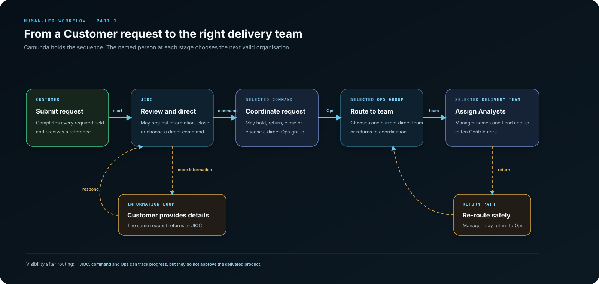
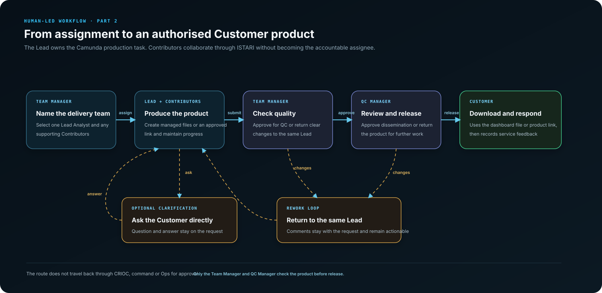
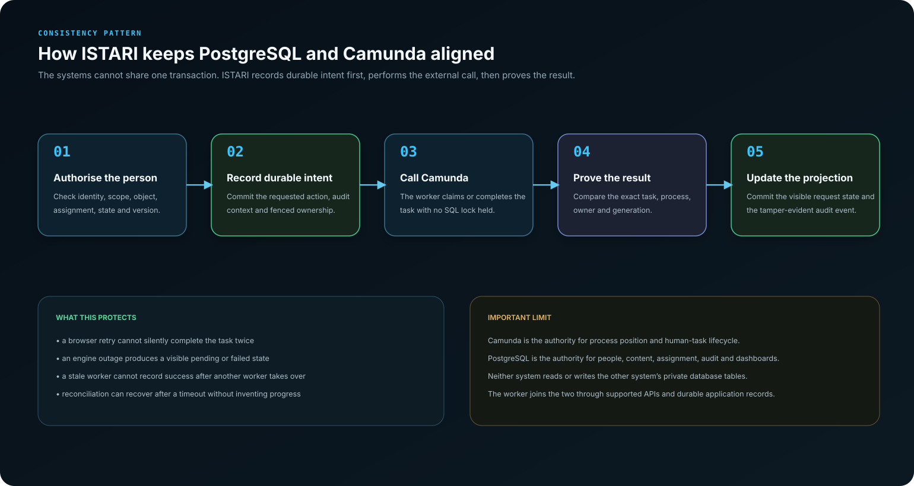

# Workflow and Camunda guide

Status: current executable workflow
Last reviewed: 10 August 2026

This guide explains how a request moves through ISTARI Service. It is written for
product owners, delivery staff, testers, developers and operators. No knowledge
of Camunda or process modelling is assumed.

## Contents

1. [The workflow in one paragraph](#the-workflow-in-one-paragraph)
2. [What BPMN and Camunda mean](#what-bpmn-and-camunda-mean)
3. [Routing the request](#routing-the-request)
4. [Producing and releasing the product](#producing-and-releasing-the-product)
5. [Every human task and outcome](#every-human-task-and-outcome)
6. [Information, hold and rework loops](#information-hold-and-rework-loops)
7. [Lead and Contributor responsibilities](#lead-and-contributor-responsibilities)
8. [What routing organisations can see afterwards](#what-routing-organisations-can-see-afterwards)
9. [How ISTARI and Camunda share responsibility](#how-istari-and-camunda-share-responsibility)
10. [Failure and recovery behaviour](#failure-and-recovery-behaviour)
11. [Changing the organisation safely](#changing-the-organisation-safely)
12. [Source and verification](#source-and-verification)

## The workflow in one paragraph

A Customer submits a complete request. CRIOC selects one of its current direct
command organisations. That command selects one of its current direct Ops groups.
The Ops group selects one of its current direct delivery teams. A Manager in that
team names one Lead Analyst and up to ten Contributing Analysts. The Lead produces
the product and may ask the Customer for more information. The Team Manager checks
the result, the QC Manager performs the final review, and the Customer receives an
authorised file download or approved product link in their dashboard. CRIOC, the
selected command and the selected Ops group can track progress, but they do not
approve the product.

## What BPMN and Camunda mean

**BPMN** stands for **Business Process Model and Notation**. It is a standard way
to describe a process as events, human tasks, decision points and connecting
paths. The executable process is stored in
[`workflow/service-request.bpmn`](../../workflow/service-request.bpmn).

**Camunda** is the workflow engine that runs that BPMN process. In ISTARI it does
three important things:

- remembers which human task is currently active;
- offers that task to the correct organisation or named person; and
- moves to the next task after an authorised person records an outcome.

Camunda does **not** read the request and decide where it should go. It does not
choose priority, team, Analyst, approval or recipient. Those are named human
decisions submitted through ISTARI Service and validated by FastAPI.

### A small BPMN vocabulary

| BPMN term | Plain-English meaning in ISTARI |
|---|---|
| Start event | The submitted request has a durable process-start command. |
| User task | A named person must review something and record an outcome. |
| Candidate group | The current organisation whose eligible users may take a routing task. |
| Assignee | The individual who owns a claimed task, or the named Lead Analyst. |
| Exclusive gateway | One recorded outcome selects exactly one next path. |
| Sequence flow | The allowed connection between two process steps. |
| End event | The request completed, was closed without delivery, or was cancelled. |

The gateways are rules about valid outcomes, not automated business decisions.
For example, the CRIOC gateway can follow `request information`, `close` or
`progress`. A CRIOC user chooses one of those outcomes. Camunda only follows the
matching path.

## Routing the request

### Direct-child routing

Each routing user chooses one organisation immediately below their current unit:

1. CRIOC chooses a command, such as JOCK, SYGOC or MYGOC.
2. The selected command chooses one of its own Ops groups.
3. The selected Ops group chooses one of its own delivery teams.

Skipping a level is not allowed. A user cannot type an arbitrary team identifier
or route into a sibling branch. The API reloads the current effective hierarchy,
checks the actor's scope, verifies the current workflow task and validates that
the selected destination is a direct child before it records the decision.

The complete configured hierarchy is in
[Organisation and routing](ORGANISATION_AND_ROUTING.md). The initial operational
route is CRIOC → JOCK → ACSA-B Ops → SSG Team. Every configured sibling remains a
real staffed destination with its own users, queue and Camunda candidate group.

### Who owns an unclaimed routing item?

Before a person claims a routing task, the responsible organisation owns it. The
interface therefore describes the item as awaiting that organisation, for example
`JOCK awaiting action`. It is not shown as personal work owned by an unnamed
individual. After a successful claim, the named person owns the human task until
they record the outcome or the task is safely recovered.

## Producing and releasing the product

The delivery route is deliberately shorter than the organisational routing path.
After assignment, work does not travel back through CRIOC, command or Ops for
approval.

1. The Team Manager selects the Lead and optional Contributors.
2. Camunda assigns the production task to the named Lead.
3. The Lead and Contributors collaborate in the authorised request workspace.
4. The Lead submits the product to the Team Manager.
5. The Team Manager approves it for QC or returns it to the same Lead.
6. The QC Manager approves dissemination or returns it to the same Lead.
7. The QC Manager releases an approved managed file or HTTPS product link.
8. The owning Customer sees the released item in their dashboard and can provide
   one feedback response.

## Every human task and outcome

The table below is the plain-English view of the executable BPMN. Internal task
IDs are included for developers and operators, but ordinary users see the task
names and action labels.

| Human task | BPMN ID | Responsible person | Available outcome | Next step |
|---|---|---|---|---|
| CRIOC Routing | `intake_review` | Claimed CRIOC Routing User | Request information | Customer response |
| CRIOC Routing | `intake_review` | Claimed CRIOC Routing User | Close | Closed without delivery |
| CRIOC Routing | `intake_review` | Claimed CRIOC Routing User | Progress to selected command | Request Coordination |
| Provide requested information | `requester_response` | Owning Customer | Provide information | CRIOC Routing |
| Provide requested information | `requester_response` | Owning Customer | Withdraw | Cancelled |
| Request Coordination | `coordination_review` | Claimed user in selected command | Return to CRIOC | CRIOC Routing |
| Request Coordination | `coordination_review` | Claimed user in selected command | Place on hold | Resolve coordination hold |
| Request Coordination | `coordination_review` | Claimed user in selected command | Close | Closed without delivery |
| Request Coordination | `coordination_review` | Claimed user in selected command | Route to selected Ops group | Ops Routing |
| Resolve coordination hold | `on_hold` | Claimed user in selected command | Resume | Request Coordination |
| Resolve coordination hold | `on_hold` | Claimed user in selected command | Close | Closed without delivery |
| Ops Routing | `allocation_review` | Claimed user in selected Ops group | Return to command | Request Coordination |
| Ops Routing | `allocation_review` | Claimed user in selected Ops group | Route to selected team | Team Assignment |
| Team Assignment | `delivery_planning` | Claimed Team Manager | Return to Ops | Ops Routing |
| Team Assignment | `delivery_planning` | Claimed Team Manager | Assign Lead and Contributors | Product Production |
| Product Production | `delivery_work` | Named Lead Analyst | Ask Customer for information | Customer production response |
| Product Production | `delivery_work` | Named Lead Analyst | Submit product | Manager Review |
| Provide production information | `customer_clarification_response` | Owning Customer | Provide information | Product Production, same Lead |
| Provide production information | `customer_clarification_response` | Owning Customer | Withdraw | Cancelled |
| Manager Review | `lead_review` | Team Manager | Changes required | Product Production, same Lead |
| Manager Review | `lead_review` | Team Manager | Approve | QC Review |
| QC Review | `quality_review` | QC Manager | Changes required | Product Production, same Lead |
| QC Review | `quality_review` | QC Manager | Approve | Dissemination |
| Dissemination | `release` | QC Manager | Release | Completed |

### End states

| End state | What it means to the Customer |
|---|---|
| Completed | An authorised product is available and the service can receive feedback. |
| Closed without delivery | A named routing user closed the request with a recorded reason. |
| Cancelled | The Customer withdrew or cancelled the request with a recorded reason. |

Customer-initiated cancellation is also available through the request dashboard
when the request is in an allowed active state. ISTARI records the reason,
completes or terminates the applicable process path safely, updates the visible
status and notifies relevant participants.

## Information, hold and rework loops

Loops are normal workflow paths, not errors.

### CRIOC information loop

CRIOC may ask the Customer to complete or clarify the initial request. The full
response is appended to the request history. The request then returns to CRIOC so
that a human can reconsider it with the new information.

### Command hold loop

The selected command may place a request on hold with a reason. The hold remains
visible in tracking and statistics. An authorised command user may later resume
the request or close it. Camunda does not set or remove the hold by time alone.

### Analyst clarification loop

The assigned Lead may ask the Customer a question and set a response deadline.
The Customer sees the action in their request dashboard and notifications. The
question, reason, deadline, answer and timestamps are stored in PostgreSQL. Work
returns to the same Lead after the Customer responds.

### Product rework loop

Both the Team Manager and QC Manager can return a product for changes. Their
reason is mandatory and remains in the request history. Work returns to the same
Lead, preserving accountability and avoiding a new routing decision.

## Lead and Contributor responsibilities

The Team Manager can select one Lead Analyst and up to ten Contributing Analysts
from current members of the exact delivery team.

- The **Lead** is accountable for the product and is the Camunda task assignee.
- **Contributors** can read and collaborate on the assigned request and its team
  work, but cannot complete the Lead's Camunda task.
- Analysts cannot claim an unassigned delivery task. A Team Manager must assign
  them.
- The Lead cannot also be listed as a Contributor. The interface removes the Lead
  from Contributor selection and the API validates the same rule.
- Assignment history records the Manager, Lead, Contributors, reason and time.

## What routing organisations can see afterwards

CRIOC, the selected command and the selected Ops group retain route-scoped
tracking after their routing action. Tracking shows the request title, reference,
current stage, responsible organisation and lifecycle path. It allows an
authorised route member to reopen the submitted request detail needed for
operational tracking.

Tracking does not grant product approval. Routing organisations cannot use it to
open unreleased product files, Customer feedback or clarification content that is
outside their authorised operational need.

Statistics follow the same hierarchy rule:

- CRIOC sees its own figures and all descendants.
- A command sees itself and its own Ops groups and teams.
- An Ops group sees itself and its own delivery teams.
- A delivery team sees its own work.
- A unit never sees its parent or sibling branches.

## How ISTARI and Camunda share responsibility

| Responsibility | ISTARI PostgreSQL and FastAPI | Camunda |
|---|---:|---:|
| Request form and immutable submitted revision | Yes | No |
| User identity, role, scope and effective team membership | Yes | Receives bounded candidate/assignee values |
| Human decision, reason and tamper-evident audit | Yes | Receives the outcome variable needed by BPMN |
| Current process position | Reconciled read model | Yes, authoritative |
| Human task lifecycle | Reconciled read model | Yes, authoritative |
| Lead and Contributor history | Yes | Lead assignee only |
| Product bytes, links, review evidence and download | Yes | No |
| Dashboard and notifications | Yes | No |

Request narrative, product content, passwords, sessions, CSRF values and file
bytes are never stored as Camunda variables.

### Durable command pattern

PostgreSQL and Camunda cannot commit one shared database transaction. ISTARI uses
a durable command pattern instead:

1. authorise the actor and validate the current version;
2. commit the requested action and audit context in PostgreSQL;
3. let the fenced worker call Camunda without holding a database lock;
4. prove the exact task or process result; and
5. commit the new visible projection and audit event.

This makes retries safe and gives support staff an explicit pending or failed
state instead of invented progress.

## Failure and recovery behaviour

| Situation | Visible and operational behaviour |
|---|---|
| Camunda is temporarily unavailable | The durable command remains pending or moves to an explicit retry/support state. |
| The Camunda search view is delayed | Reconciliation waits for proof; it does not select a different task. |
| The browser repeats a submission | Idempotency and expected-version checks prevent duplicate workflow progress. |
| A worker stops after the external call | Its lease expires and another worker proves the actual engine state before finalising. |
| An organisation is unstaffed | The route remains visible as awaiting staffing; ISTARI does not borrow another team's users. |
| A user loses membership or is deactivated | Authorisation is checked again before finalisation and the action fails closed. |
| A stale task link is opened | No accessible task is returned; the interface explains that the action has ended or moved. |

Operational recovery procedures are in the
[support and incident runbook](../operations/SUPPORT_AND_INCIDENT_RUNBOOK.md) and
[backup, restore and maintenance guide](../operations/BACKUP_RESTORE_AND_MAINTENANCE.md).

## Changing the organisation safely

Organisation changes are effective-dated and versioned. An Administrator prepares
proposed changes, a different authorised Administrator approves the sealed
revision, and activation applies it from its effective time. A request pins the
configuration revision active when that request begins. It does not silently
change route because a team is renamed, moved or retired later.

The BPMN process is deliberately organisation-neutral. It asks for a valid direct
child at each routing stage. Adding a new command, Ops group or team therefore
does not require a separate BPMN file for every organisation.

## Source and verification

| Need | Source |
|---|---|
| Executable process | [`workflow/service-request.bpmn`](../../workflow/service-request.bpmn) |
| Process deployment and compatibility | [Release runbook](../deployment/RELEASE_RUNBOOK.md) |
| Organisation hierarchy and users | [Organisation and routing](ORGANISATION_AND_ROUTING.md) |
| Role and action permissions | [Role and permission matrix](../reference/ROLE_PERMISSION_MATRIX.md) |
| Durable command decision | [ADR 0003](../adr/0003-durable-human-workflow-commands.md) |
| Current system architecture | [System architecture](SYSTEM_ARCHITECTURE.md) |
| Workflow threat controls | [Service-request threat model](../threat-model/service-request-workflow.md) |
| Browser and workflow evidence | [Browser and workflow evidence](../assurance/BROWSER_AND_WORKFLOW_EVIDENCE.md) |

The deployment helper verifies the process identifier and deploys this exact BPMN
to the local Camunda runtime. Automated tests cover happy paths, every loop,
invalid outcomes, stale versions, cross-role access, cross-scope access,
reconciliation and engine interruption.
