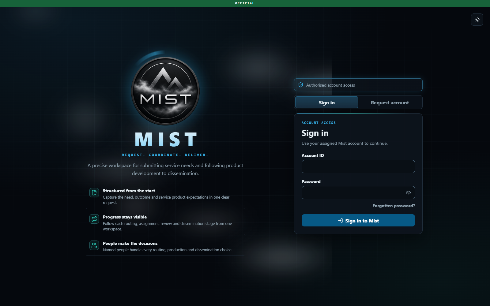
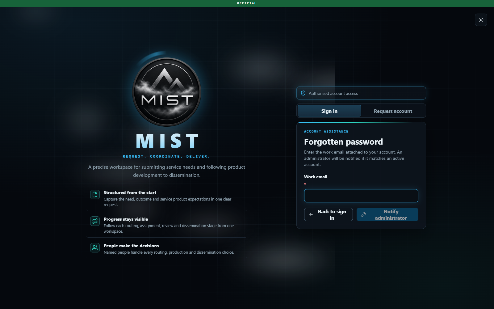
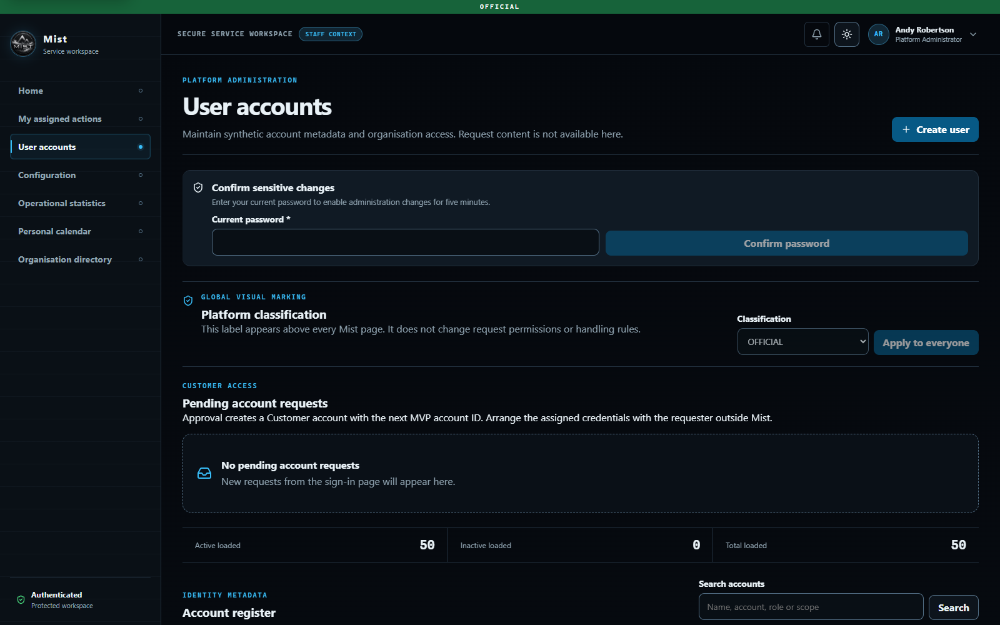
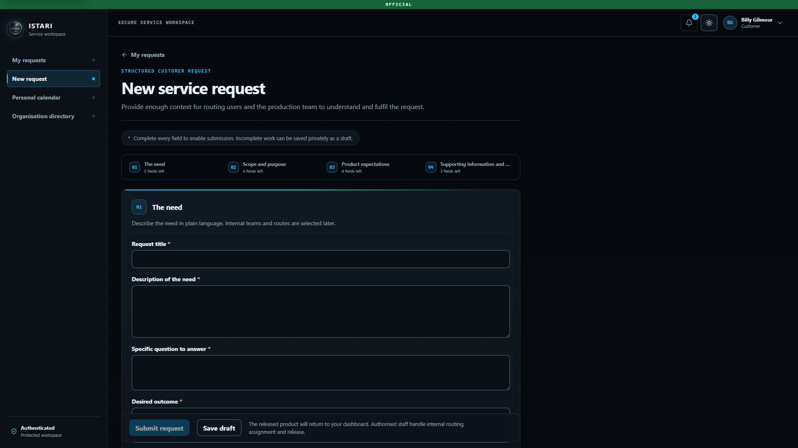
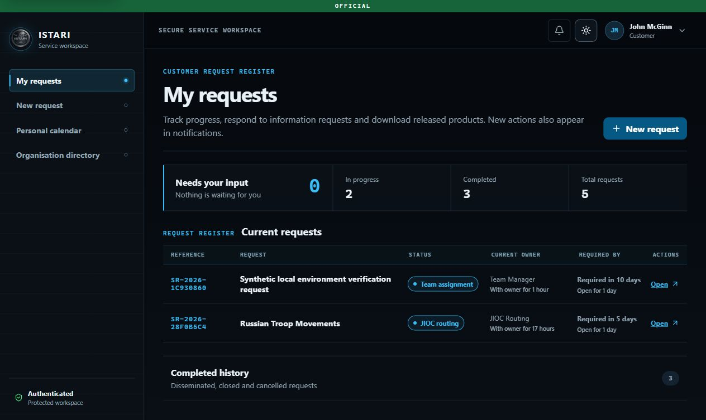
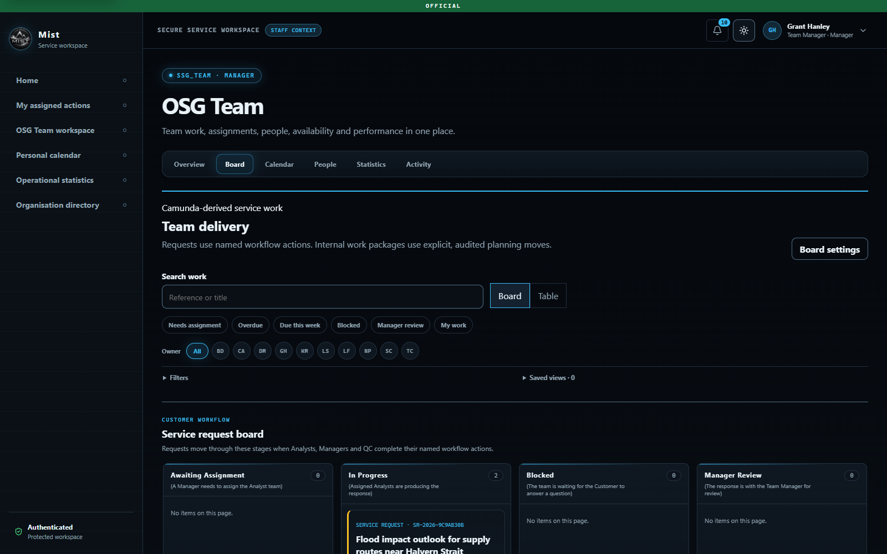
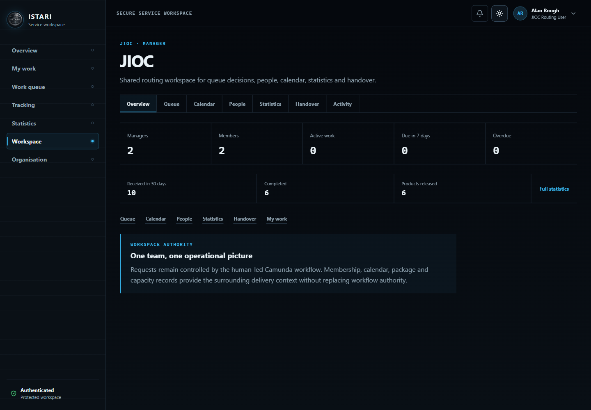
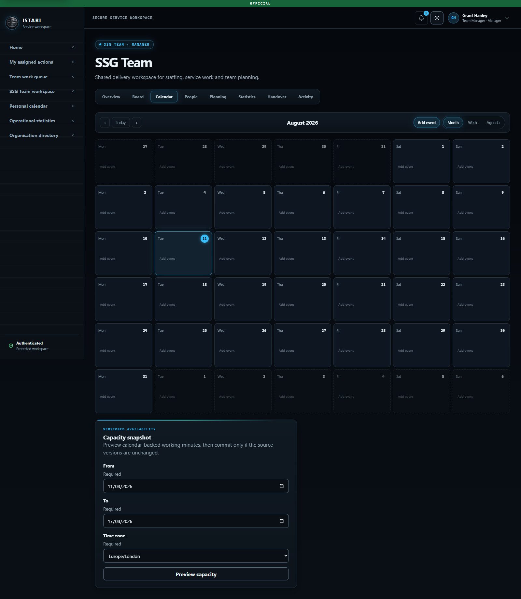
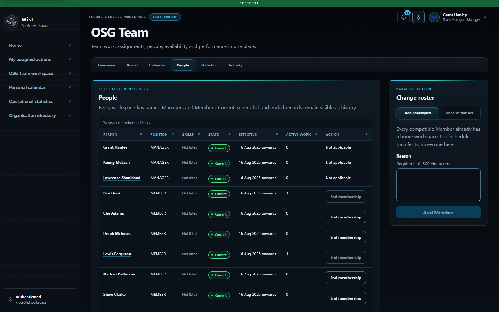

# Browser and workflow evidence

This file contains current visual orientation and dated assurance records. The
source-controlled screenshots below were captured from the running synthetic
local application between 9 and 11 August 2026. Screenshots are refreshed when their
surface changes materially. The latest Customer form, Customer register, team
board, calendar, people, CRIOC workspace and administration captures use the
current local source and produced no browser warning or error. The images prove
that the documented screens rendered, but are not a source-to-image attestation,
accessibility acceptance or evidence that every detailed capability gate is
closed.

The workflow and cross-browser records after the screenshots are dated evidence.
Their recorded scope does not prove managed-product or guided-configuration
capabilities and must not be used to close current browser or acceptance gates.

## Complete context, conversation and release journey, 14 August 2026

A real Chromium session exercised the current application through Customer
submission, CRIOC, JOCK, ACSA-B Ops and SSG Team. The delivery assignment reached
Ben Doak and the assigned-Analyst experience exposed the production controls and
Lead accountability label correctly. Structured messages were sent through the
request timeline, a covering note and managed package were submitted, and the
Team Manager completed review.

One QC Team Manager claimed and approved quality review. A different QC Team
Manager claimed dissemination and released the approved package. The Customer
opened the released product and recorded acceptance. Customer/Staff context
switching, context-specific landing pages and protected-cache rotation were
covered by the current frontend regression suite.

## Route lifecycle and chart presentation, 10 August 2026

The rebuilt local production containers were exercised with a CRIOC routing
session. Tracking showed title-first rows, linked references, exact selected
routes and delivery lifecycles. Selecting **Russian Troop Movements** opened
`/tracking/{requestId}` and displayed the original submitted request in a
read-only view without workflow actions or product controls.

The same session opened Statistics at the CRIOC grant root. Current status,
due-date risk and active request age rendered as donut charts, and completed
stage duration rendered median and 90th-percentile ranges. Legends, textual
summaries and table disclosures remained present. The browser console contained
no warnings or errors.

## Current application screenshots

The images deliberately contain only synthetic fixtures. Nine representative
screens are retained in source control, with one current image for each surface.

### Login

Blank login form in the graphite ISTARI visual system. No credential is shown.
The green `OFFICIAL` strip is visible at the top and the secondary forgotten
password action remains subordinate to sign-in.

### Password assistance

The anonymous assistance state accepts a governed work email and returns the
same non-disclosing response whether or not an active account matches. A valid
submission notifies all active Platform Administrators and exposes only the
matching account identifier, not the submitted email, in the mandatory
account-security notification. The screenshot shows the state before any
notification is sent.

### Global classification administration

Platform Administrator `admin1` on User accounts. The global classification
control shows the default `OFFICIAL` marking and remains disabled until the
Administrator confirms their current password for a five-minute sensitive change
window. The page states that the strip is a visual marking and does not
change request permissions or handling rules.

### Structured request form

Customer `admin2` on the blank service-request form. The visible required
markers and explanatory text show that every submission field is mandatory,
while private incomplete drafts remain possible.

### Customer request tracking

Customer `admin2` on `My requests`. The summary separates requests needing the
Customer's input from other in-progress and completed requests. Each visible row
shows its title, status, current owner, age, required-date proximity and a direct
request link. Authenticated product download and feedback appear here after
dissemination; the historical completed-journey evidence below proves that
separate state-changing path.

### Team workflow board

SSG Team Manager `admin8` on the SSG Team Board. The view identifies requests as
Camunda-derived projections and exposes quick views, filters, saved views and a
table alternative without allowing board gestures to bypass named workflow
actions.

### Routing workspace

CRIOC Manager `admin74` on the CRIOC Overview. The routing workspace provides a
single operational entry point to its Work queue, Calendar, People, Statistics
and Activity views. It does not expose delivery-team package controls or add a
Manager approval stage to routing.

### Shared team calendar

SSG Team Manager `admin8` on the shared Calendar. Every current member can add
their own leave, course, training and availability records. Exact-team Managers
can also add unit events and, for delivery teams only, link commitments to
eligible tickets. Month, week and agenda modes share the same governed records.

### Effective-dated team roster

SSG Team Manager `admin8` on People. Current and historical Manager and Member
positions remain visible. Manager appointment, transfer and end actions require
effective dates and reasons; platform administrators retain organisation-wide
control.

## Automated workspace-state coverage

The current 490-test frontend suite passed on 14 August 2026 with 98.80 per cent
line and 95.04 per cent branch coverage. It includes access-assistance,
classification, routing-workspace,
effective-membership, self-service calendar, assigned-Analyst, conversation, context-switch, collaboration
and hierarchy-statistics regressions. The following table began as the candidate
index recorded on 7 August 2026 and now identifies the principal current test
locations. The frontend suite covers loading, empty, success and
recoverable-error presentation throughout the critical workspaces. Conflict,
stale-version and permission outcomes were also exercised at API and form
boundaries.

| Workspace | Principal evidence |
| --- | --- |
| Authentication, context and route policy | `apps/web/src/app/auth-flow.test.tsx`, `apps/web/src/app/context-switch-flow.test.tsx` |
| Password assistance and classification | `apps/web/src/features/auth/password-assistance-flow.test.tsx`, `apps/web/src/features/admin/admin-flow.test.tsx`, `apps/web/src/features/admin/classification-control.test.tsx` |
| Customer register and request detail | `apps/web/src/features/requests/requester-flow.test.tsx`, `apps/web/src/features/requests/branch-states.test.tsx` |
| Drafts and mandatory form | `apps/web/src/features/requests/draft-flow.test.tsx`, `apps/web/src/features/requests/requester-flow.test.tsx` |
| Staff queues and routing | `apps/web/src/features/work/staff-flow.test.tsx`, `apps/web/src/features/work/routing-options-flow.test.tsx` |
| Product review | `apps/web/src/features/work/staff-deliverable-flow.test.tsx` |
| Tracking and conversations | `apps/web/src/features/tracking/tracking-flow.test.tsx`, `apps/web/src/features/tracking/tracking-conversations.test.tsx` |
| Statistics | `apps/web/src/features/statistics/StatisticsPage.test.tsx` |
| Team and routing workspaces | `apps/web/src/features/teams/TeamWorkspacePage.test.tsx`, `apps/web/src/features/teams/RoutingWorkspacePage.test.tsx` |
| Calendar and capacity | `apps/web/src/features/calendar/CalendarPage.test.tsx` |
| Board and packages | `apps/web/src/features/board/TeamBoardPage.test.tsx` |
| Platform administration | `apps/web/src/features/admin/admin-flow.test.tsx` |
| Organisation | `apps/web/src/features/organisation/organisation-flow.test.tsx` |

## Historical MVP environment

Recorded on 7 August 2026 against the production React image, FastAPI,
PostgreSQL 17.9 and Camunda 8.9.14. Installed browser versions were Chrome
151.0.7922.75, Edge 151.0.4129.59 and Firefox 153.0.

## Complete Customer and delivery journey

Request `SR-2026-A5660D8D` completed through the real application and workflow:

1. Customer `admin2` proved mandatory-field rejection, then submitted a complete
   request and saw it in the tracking register.
2. CRIOC `admin4` recorded related records and selected JOCK.
3. Command user `admin5` selected ACSA-B Ops, then Ops user `admin6` selected
   SSG Team.
4. SSG Manager `admin8` assigned Lewis Ferguson (`admin11`).
5. The Analyst requested additional information. The Customer response was
   retained in the dashboard and returned to the same Analyst assignment.
6. The Analyst submitted a product. SSG Manager approved it and QC user
   `admin15` separately approved and disseminated it to a required recipient.
7. The Customer saw `Completed`, the full activity and clarification history,
   downloaded the authenticated product link and submitted one-time mandatory
   rating and comments.

No CRIOC, command or Ops approval was inserted into the return path.

## Alternative route proof

`scripts/run-local-app-journey.py` completed request `SR-2026-4D12E2BA` through
SYGOC, Nimbus Ops and Beacon Team. Archie Gemmill produced the product and the
Customer download was verified. The content-free result is retained at
`output/playwright/alternative-app-journey.json`.

`scripts/smoke-camunda.ps1` separately completed both the SSG route with two
clarification loops and an alternative staffed route. Candidate groups remained
distinct and no alternative route fell back to SSG.

## Team and management journeys

- SSG Team showed three Managers and seven Analysts.
- A Manager ended and re-added Ben Doak using mandatory reasons. Current and
  historical membership remained visible.
- Board, accessible table, WIP limits, saved filters and required work-package
  fields rendered from workflow and team planning records.
- Calendar month, week and agenda views, privacy, recurrence and capacity
  controls were exercised.
- Statistics showed SSG only to the SSG Manager, CRIOC and child commands to the
  CRIOC Manager, and only explicit JOCK, SYGOC and MYGOC scopes to the shared
  command account.

## Compatibility result

Critical pages rendered and remained navigable in current Chrome, Edge and
Firefox at desktop and narrow widths. Screenshots are retained in
`output/playwright`. Customer authentication, tracking, released-product,
clarification, feedback and mandatory-form validation passed in all three
browsers and are retained as Playwright CLI traces:

- `chrome-customer-acceptance.trace`;
- `edge-customer-acceptance.trace`;
- `firefox-customer-acceptance.trace`.

Additional Chrome traces cover the Team Manager queue, roster, calendar, board
and exact-team statistics; CRIOC metadata tracking and CRIOC-only statistics; and
the 72-account dataset used for that dated Administrator register, step-up and create-user
form. Trace names, browser versions, scenarios and SHA-256 values are recorded in
`output/playwright/browser-acceptance.json`.

The complete end-to-end state-changing delivery journey was repeated in Edge
151.0.4129.59 as request `SR-2026-0D8A4A96` on the SSG route and Firefox 153.0
as request `SR-2026-79C5D79F` on the SYGOC, Nimbus Ops and Beacon Team route.
Both journeys included named claims and routing decisions, Team Manager
assignment, Analyst clarification, Customer response, Analyst product
submission, Manager review, separate QC approval, dissemination, authenticated
download and required feedback. PostgreSQL reconciliation found both requests,
products and Camunda workflow instances completed, one clarification thread
with two messages in each, and ratings of five and four respectively.

The raw traces, network logs, completion screenshots and downloaded products are
retained in `output/playwright`. Their hashes are recorded in
`output/playwright/browser-acceptance.json`. The validated final reports are:

- `output/playwright/cross-browser-staff-acceptance.html`;
- `output/playwright/cross-browser-staff-acceptance.junit.xml`.

The final report SHA-256 values are
`F035EEE71CEBACB3345CBC52A80164BF5013AF2D0CF837C605A41CA52B6EF080` for
the HTML report and
`F5B727A85E40C97C85F23539B17818D2EC23A3162A90CCC7A8E154B25B9ACA6A`
for the JUnit report. The manifest SHA-256 is
`548B8D2D2BE0DD06D48D61904FBD6DC21E81427124B8D6BBF870182A01908E96`.

Run `uv run --directory apps/api python
../../scripts/render-browser-acceptance.py` to verify every evidence hash and
regenerate both reports. DOD-31 and DOD-44 are evidence-ready. Product-owner and
representative-user acceptance remain separate human decisions.

## Operator-orientation browser check

On 8 August 2026, the React source was served locally and inspected in Chromium
against the synthetic local API. The Customer workspace showed exactly one
`aria-current="page"` item on both `/requests` and `/requests/new`. The account
dialog closed on Escape and route change, remained within a 640-pixel viewport,
and keyboard focus produced a visible two-pixel outline. Current profile content
and fields are specified in the [user stories](../USER_STORIES.md#cust-09-maintain-a-personal-profile-and-calendar)
and verified by the current component suite.

This focused check covers the changed shell at desktop and narrow width. It does
not replace the recorded three-browser baseline or constitute representative
accessibility acceptance. Routing breadcrumb behaviour is covered by component
accessibility tests. The rebuilt target API subsequently returned `CRIOC [CRIOC]`
and exactly the three configured Command children from PostgreSQL. A complete
current-source target journey also passed through SYGOC, Nimbus Ops and Beacon
Team. Representative routing and accessibility acceptance remain required.

## Target-scale cursor browser check

On 8 August 2026, Chromium controlled through the Playwright CLI exercised the
production-built React and FastAPI images against the clean 2,500-row PostgreSQL
17.9 fixture at migration `0019_runtime_scaling`.

- Customer `admin2` rendered 50 requests and 50 private drafts, then loaded a
  cursor page. One hundred drafts remained visible and both older-request and
  older-draft responses returned successfully.
- CRIOC user `admin4` rendered and retained 100 staff-work items, then retained
  100 route-scoped tracking rows after loading another page.
- SSG Manager `admin8` opened the SSG Board and moved from 25 cards on page one
  to 25 cards on page two using the opaque Board cursor.
- Platform Administrator `admin1` retained 100 user-register rows after loading
  another page.

Cursor responses took 31.6 to 51.7 ms in this local topology. The only console
error was the expected anonymous `/auth/me` HTTP 401 probe before each login;
authenticated pages produced no unexpected console error. The target-scale
check is Chromium-only and read-oriented. It supplements, rather than replaces,
the historical three-browser state-changing workflow acceptance above.

The content-free traces and screenshots are under
`output/playwright/runtime-scale`. Trace SHA-256 values are:

- Customer pagination: `5DBD5F150B75C2F63A352247755AAC81293063F64A65D10574FDC140F5C54F63`;
- routing pagination: `DAD29C589AF9C67BDCA11D77B1CE25750064DE462D793655167AA960536F781D`;
- Board pagination: `274F2475D4BD82657C9D374552AE3B8A052FB1BCA5692E862E8F3327E05B450C`;
- administration pagination: `CD089B2BC70E76DBFD6E154B49497CD8FEA6CC998755C9A381185EFBB0464F2E`.

`output/load/runtime-scale-manifest.json` binds every trace, network log,
screenshot, fixture, plan result and HTTP result to a content hash. These local
generated files must be copied to the approved immutable evidence store when a
candidate release is qualified.

## Team-operations candidate browser check

On 10 August 2026, the rebuilt Compose candidate at migration
`0030_team_operational_skills` was inspected in the in-app Chromium browser.

## Role-aware action-link regression, 10 August 2026

The local Compose candidate was rebuilt and migrated to
`0031_role_aware_action_links`. PostgreSQL confirmed that the active Russian
Troop Movements projection was assigned to admin4 and stored the role-owned link
`/triage?requestId=28f0b5c4-e459-441f-80eb-c4620162b182`.

The existing in-app browser session was reloaded against the rebuilt candidate.
The following visible behaviour was then exercised as Scott McTominay (admin4):

1. Primary navigation showed `My actions`, `CRIOC queue` and `CRIOC workspace` as
   separate destinations.
2. My actions showed Russian Troop Movements as `Assigned to you`.
3. Open navigated to the exact stored CRIOC queue link.
4. The CRIOC queue selected SR-2026-28F0B5C4 and rendered Russian Troop Movements,
   its full request record, previous-request matching and the human decision
   form. It did not redirect to Overview or silently select another ticket.
5. The CRIOC queue navigation item exposed `aria-current="page"` and the active
   styling class on the selected route.

The migration was then downgraded once and re-upgraded against the live
PostgreSQL dataset. The repaired personal audience and exact role-owned link
were present after the rehearsal.
Every service was healthy, including PostgreSQL 17.10, Camunda 8.9.14, the API,
worker, web tier and antivirus services.

- SSG Manager `admin8` saw linked assignment, clarification, review, due-risk,
  capacity, calendar, people, handover, activity and exact-team statistics on the
  workspace home.
- The SSG Board exposed active lanes first, collapsed exception and terminal
  groups, a table alternative and complete filtered column totals. Expanding the
  terminal group returned two completed requests and the side inspector loaded
  the authorised Customer requirement and delivery context.
- CRIOC Manager `admin74` saw a routing-only decision home, its Manager/Member
  roster and one exact-unit CRIOC routing decision. The unit Queue contained that
  same decision and did not expose delivery Kanban or allocation controls.
- No unexpected browser console warning or error was recorded. One safe 404 in
  the first SSG inspector pass exposed an overly narrow terminal-history policy;
  exact-team Manager history access was corrected, regression-tested and then
  verified successfully against the same PostgreSQL record.

This focused current-candidate check is read-oriented and Chromium-only. It does
not replace representative-user, cross-browser or accessibility acceptance.

## Request coordination language and ownership, 10 August 2026

The Compose candidate was rebuilt without resetting its volumes and migrated to
`0032_coordination_language`. PostgreSQL confirmed that admin5's existing scope
became `Shared request coordination` and the active SR-2026-1C930860 owner became
`Request Coordination`.

The in-app browser was reloaded and the following read-only presentation was
verified as Callum McGregor (admin5):

1. The account menu and profile displayed `Request Coordination User`, with the
   assigned JOCK, SYGOC and MYGOC workspaces unchanged.
2. Primary navigation and the queue heading displayed `Incoming requests`.
3. The queue explained that a new request required attention and must be claimed
   before its details and onward organisation decision were available.
4. My actions labelled the work `New request requires attention`, separated
   `Available to JOCK` from `JOCK · Awaiting owner`, and retained the exact
   deep link back to the request in the coordination queue.
5. No browser warning or error was recorded.

This check validates the local Chromium presentation and existing-data
migration. Representative-user, cross-browser and formal accessibility
acceptance remain separate release activities.
