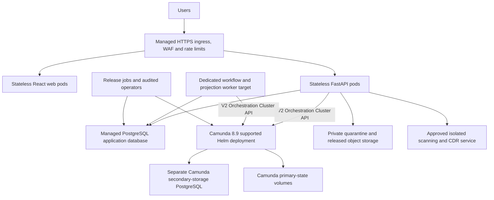

# Portable Kubernetes production target

Status: target architecture only, not implemented or validated
Last reviewed: 18 August 2026

The repository contains no application Helm chart, Kubernetes manifests or
infrastructure as code. These steps describe the intended delivery sequence and
must not be used to claim that Mist supports production Kubernetes today.
Camunda's own supported-version, licence and production guidance remains
authoritative.

## Target topology

Application PostgreSQL, Camunda primary state, Camunda secondary storage and
product objects have distinct ownership and recovery semantics. They require a
joined recovery plan. Application code must not read Camunda-owned database
tables. The application already packages asynchronous workflow and projection
work as the separately deployable `mist-worker` executable. A
production chart still needs to define its probes, resources, disruption
policy, connection budget and replica strategy.

## Platform-neutral implementation sequence

1. Select Kubernetes, Camunda 8.9 and Helm chart versions from Camunda's current
   [supported environment](https://docs.camunda.io/docs/reference/supported-environments/)
   and [production Helm](https://docs.camunda.io/docs/self-managed/deployment/helm/install/production/)
   guidance. Record the choice and licence in an ADR.
2. Provision private cluster networking, private DNS, controlled egress and an
   approved HTTPS ingress or gateway. API, database, Camunda and scanner must not
   have public endpoints.
3. Integrate an enterprise OIDC provider with MFA, immutable subject mapping,
   group-to-role/scope policy, logout and initial-administrator enrolment.
4. Provision distinct application and Camunda PostgreSQL services with verified
   TLS, separate identities, PITR, backups and tested connection budgets.
5. Install Camunda through its official chart with supported stateful storage,
   TLS, authentication, authorisation, topology spread and backups. Do not copy
   the unprotected local Compose settings.
6. Implement and test cloud object-store and approved scanner/CDR adapters.
   Quarantine and released objects need distinct policy boundaries, encryption,
   versioning, retention and public-access prevention.
7. Build immutable API and web images. Produce an SBOM, scan every deployed
   image, sign the images and verify signatures at admission.
8. Inject secrets through a platform secret store and workload identity. Keep
   migration, runtime, backup, Camunda and scanner credentials separate.
9. Run database bootstrap once through an approved administrator path. For each
   release, run Alembic and permission application as a bounded Job before
   rolling application pods.
10. Validate and deploy the exact BPMN through an operator-controlled Job, then
    attest process ID, version, definition key, deployment key and checksum in
    application PostgreSQL.
11. Deploy web, API and maintenance workloads with non-root identities,
    read-only roots where possible, resource limits, probes, disruption budgets,
    anti-affinity/topology spread and restricted service accounts.
12. Apply default-deny NetworkPolicies. Permit only browser-to-edge,
    edge-to-web/API, API/worker-to-required services and approved monitoring or
    maintenance flows.
13. Send content-minimised logs, metrics and traces to the approved observability
    service. Define dashboards, alerts, on-call ownership and tested runbooks.
14. Exercise migration, rollback, workflow failure, scanner failure, dependency
    recovery, load, autoscaling, object-level authorisation and joined disaster
    recovery before accepting staging or production.

## Provider mapping

| Concern | AWS target | Google Cloud target | Azure target |
|---|---|---|---|
| Kubernetes | EKS | Regional GKE | AKS |
| Image registry | ECR | Artifact Registry | ACR |
| Application PostgreSQL | RDS/Aurora PostgreSQL | Cloud SQL PostgreSQL | Azure Database for PostgreSQL |
| Product objects | S3 with KMS | GCS with Cloud KMS | Blob Storage with Key Vault-managed keys |
| Workload identity | EKS Pod Identity/IRSA | Workload Identity Federation for GKE | Microsoft Entra Workload ID |
| Secret service | Secrets Manager | Secret Manager | Key Vault |
| Camunda primary volumes | EBS CSI | Persistent Disk CSI | Azure Disk CSI |
| Edge | ALB/Gateway, WAF, ACM | HTTPS load balancer/Gateway, Cloud Armor | Application Gateway/Front Door and WAF |

These mappings are design inputs, not supplied modules. Provider-specific
identity, TLS, backup, regional failover, quotas and private-endpoint behaviour
must be proved in the chosen landing zone.

## Explicitly unsuitable current targets

- AWS Lambda and function platforms, because the API and maintenance worker are
  long-running services with durable sessions and leases.
- Default scale-to-zero Cloud Run or similar serverless containers, because the
  independent worker requires continuously allocated execution and a fresh
  durable heartbeat.
- Public single-VM Compose, because Camunda is deliberately unauthenticated and
  the topology has no production ingress, identity or HA boundary.
- Generic ECS/Fargate or managed-container instructions until production product
  storage, migration/workflow release jobs and worker deployment assets exist.

## Exit criteria

The target becomes supported only when versioned infrastructure code, immutable
images, deployment automation, target-environment tests, security review,
performance evidence, restore rehearsal and accountable acceptance are stored
with a release candidate. See [Production gates](PRODUCTION_GATES.md).
